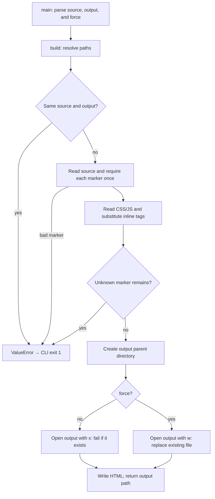

# How a source lesson becomes one portable HTML file

This is a source-backed walkthrough of the ELI5 builder, not an exhaustive map
of TEST_AGENTS. Scope: build.py and its packaging tests. Source was inspected;
the five packaging tests were executed successfully. The diagram is a static
control-flow explanation, not a debugger trace.

## The short explanation

Think of the builder as packing a small suitcase. The authored HTML describes
the lesson; the CSS and JavaScript are the belongings it needs. The builder
replaces two marked spaces with those assets so the resulting HTML can travel
as one file.

The analogy has a limit: this is text substitution, not a full web bundler.
It does not follow arbitrary imports, fetch resources, or sanitize HTML.

## Follow one input

Input: cache-lab.html plus a new output path, without --force.

1. **Observed — entrypoint:** main() parses arguments and calls build().
   [build.py](../skills/eli5/scripts/build.py), lines 32–45.
2. **Observed — boundary:** build() resolves both paths and refuses to overwrite
   the source itself. The source must exist and decode as UTF-8.
   [build.py](../skills/eli5/scripts/build.py), lines 10–15.
3. **Observed — transformation:** the CSS and script markers must each occur
   exactly once. Their contents are loaded from the skill assets and inserted
   as inline style/script tags; any remaining ELI5 marker causes failure.
   [build.py](../skills/eli5/scripts/build.py), lines 16–25.
4. **Observed — side effect:** it creates the parent directory and writes the
   output. With no force flag, exclusive creation preserves an existing file.
   [build.py](../skills/eli5/scripts/build.py), lines 26–29.
5. **Observed — failure path:** OSError and ValueError become a CLI error and
   exit code 1. No success path is returned from that exception branch.
   [build.py](../skills/eli5/scripts/build.py), lines 38–41.

## Why these choices matter

- **Observed:** refusing a source/output collision protects the authored source.
- **Inferred intent:** exact marker counts likely prevent accidentally generating
  a partially styled or multiply injected page. The condition is directly visible;
  the author's broader rationale is not documented.
- **Unknown without inspecting a particular input:** whether that HTML contains
  external URLs, valid JavaScript, or an accurate explanation. The builder does
  not establish those properties.

## What the tests prove

[test_build.py](../skills/eli5/scripts/test_build.py) exercises packaging the
bundled example, preservation of existing output, missing-marker failure,
source overwrite prevention even with force, and explicit output replacement.
Those five tests passed. They do not prove every future lesson is correct or
that all source files can be safely embedded.

Reading order: main() → build() → test_build.py → the specific lesson source.
For an interactive view, compile the accompanying builder-walkthrough.source.html
with the ELI5 builder. Its source references are inline so they remain usable
after copying the generated page to another machine.
