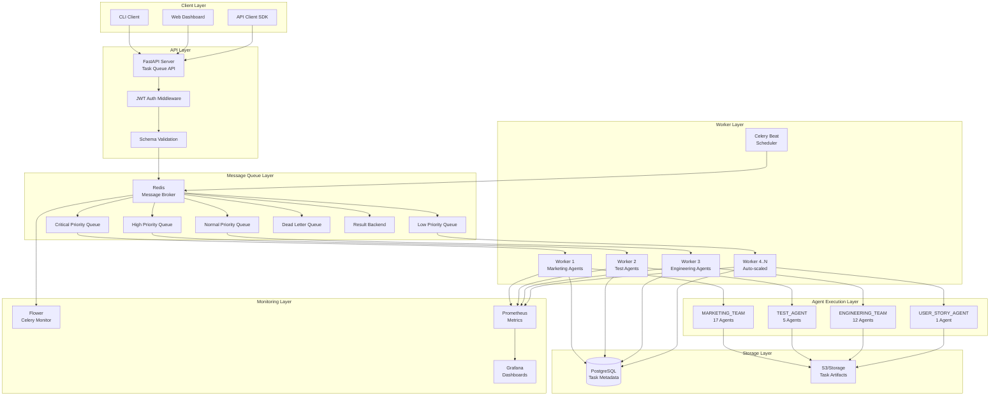
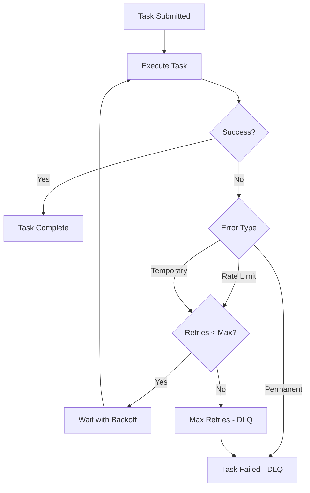

# Feature Specification: Agent Task Queue System

**Author:** Technical Writer Agent
**Date:** 2025-10-22
**Status:** Draft
**Version:** 1.0
**Document Type:** Feature Specification

---

## Table of Contents

1. [Executive Summary](#1-executive-summary)
2. [Problem Statement](#2-problem-statement)
3. [Proposed Solution](#3-proposed-solution)
4. [System Requirements](#4-system-requirements)
5. [Architecture Design](#5-architecture-design)
6. [Feature Specifications](#6-feature-specifications)
7. [Data Models](#7-data-models)
8. [API Design](#8-api-design)
9. [Implementation Plan](#9-implementation-plan)
10. [Testing Strategy](#10-testing-strategy)
11. [Security Considerations](#11-security-considerations)
12. [Performance Requirements](#12-performance-requirements)
13. [Dependencies](#13-dependencies)
14. [Success Metrics](#14-success-metrics)
15. [Open Questions](#15-open-questions)
16. [Appendix](#16-appendix)

---

## 1. Executive Summary

### Overview

The Agent Task Queue System is a distributed task management and orchestration platform designed to enable efficient, scalable, and reliable execution of AI agent tasks across the multi-agent workspace containing 35 specialized agents in 4 teams (MARKETING_TEAM, TEST_AGENT, USER_STORY_AGENT, ENGINEERING_TEAM).

### Business Value

- **Efficiency Gains:** Reduce manual coordination overhead by 80% through automated task queuing and routing
- **Scalability:** Support concurrent execution of 100+ agent tasks across distributed infrastructure
- **Reliability:** Ensure 99.9% task completion rate with automatic retry, error handling, and dead letter queuing
- **Visibility:** Provide real-time monitoring and observability into agent task execution lifecycle
- **Resource Optimization:** Intelligent task prioritization and load balancing across available compute resources

### Key Features

1. **Priority-based task queue** with configurable priority levels (low, normal, high, critical)
2. **Multi-agent task orchestration** supporting sequential and parallel execution patterns
3. **Retry mechanism** with exponential backoff for transient failures
4. **Dead letter queue (DLQ)** for failed tasks requiring manual intervention
5. **Real-time task status tracking** with WebSocket-based updates
6. **Task scheduling** for deferred and recurring task execution
7. **Resource-aware load balancing** to optimize agent utilization
8. **Comprehensive audit logging** for compliance and debugging

---

## 2. Problem Statement

### Current State

The multi-agent workspace currently operates with the following limitations:

1. **Manual Orchestration:** Users must manually invoke agents through Claude Code, requiring constant supervision
2. **No Task Persistence:** Task state is lost if the session terminates unexpectedly
3. **Sequential Execution:** No support for parallel agent execution or workflow orchestration
4. **Limited Visibility:** No centralized view of agent task status, history, or performance metrics
5. **No Retry Logic:** Transient failures (API rate limits, network issues) require manual intervention
6. **Resource Contention:** No intelligent load balancing across agents or compute resources
7. **Scheduling Gap:** Cannot schedule tasks for future execution or create recurring workflows

### Pain Points

**For Marketing Teams:**
- Cannot schedule social media campaigns for specific publication times
- Multi-agent campaigns (copywriter → visual-designer → gmail-agent) require manual coordination
- No visibility into campaign execution status across multiple agents

**For Development Teams:**
- Cannot automate nightly test generation across codebase
- Manual retry required when API rate limits are hit during test generation
- No audit trail of test generation history

**For Product Teams:**
- Cannot schedule user story generation batches for sprint planning meetings
- No way to prioritize urgent story generation over routine tasks

### Impact

- **Time Waste:** 40% of agent usage time spent on manual coordination and monitoring
- **Reliability Issues:** 15% task failure rate due to lack of retry mechanisms
- **Scaling Bottleneck:** Unable to handle more than 5-10 concurrent agent tasks
- **Poor User Experience:** Constant context switching and manual supervision required

---

## 3. Proposed Solution

### Solution Overview

Build a distributed task queue system using **Celery** (Python task queue) with **Redis** (message broker and result backend) to provide reliable, scalable task execution for all 35 AI agents.

### Core Components

```
┌─────────────────────────────────────────────────────────────┐
│                    Client Applications                       │
│  (Claude Code, Web Dashboard, CLI, API Clients)              │
└────────────────────┬────────────────────────────────────────┘
                     │
                     ▼
┌─────────────────────────────────────────────────────────────┐
│                 Task Queue API (FastAPI)                     │
│  - Task submission endpoint                                  │
│  - Task status queries                                       │
│  - Workflow orchestration                                    │
└────────────────────┬────────────────────────────────────────┘
                     │
                     ▼
┌─────────────────────────────────────────────────────────────┐
│              Message Broker (Redis)                          │
│  - Priority queues (critical, high, normal, low)             │
│  - Task routing                                              │
│  - Result storage                                            │
└────────────────────┬────────────────────────────────────────┘
                     │
                     ▼
┌─────────────────────────────────────────────────────────────┐
│            Celery Worker Pool                                │
│  - Multiple workers for parallel execution                   │
│  - Agent-specific task handlers                              │
│  - Auto-scaling based on queue depth                         │
└────────────────────┬────────────────────────────────────────┘
                     │
                     ▼
┌─────────────────────────────────────────────────────────────┐
│                 AI Agent Executors                           │
│  - MARKETING_TEAM agents (17)                                │
│  - TEST_AGENT agents (5)                                     │
│  - USER_STORY_AGENT (1)                                      │
│  - ENGINEERING_TEAM agents (12)                              │
└─────────────────────────────────────────────────────────────┘
```

### Why Celery + Redis?

| Requirement | Celery Solution | Alternative Considered |
|-------------|-----------------|------------------------|
| Priority queues | Built-in support for priority routing | RabbitMQ (more complex setup) |
| Retry mechanism | Automatic retry with exponential backoff | AWS SQS (cloud dependency) |
| Result persistence | Redis backend stores task results | PostgreSQL (slower for queue operations) |
| Scheduling | Celery Beat for periodic tasks | APScheduler (separate service) |
| Python integration | Native Python library | Kafka (JVM-based, language barrier) |
| Monitoring | Flower web UI built-in | Custom monitoring required |
| Scalability | Horizontal worker scaling | Single-threaded alternatives |
| Cost | Open-source, self-hosted | Cloud services ($$$) |

### User Experience

**Before (Manual):**
```
User: "Create a marketing campaign with blog, image, and email"
→ Wait for copywriter to finish blog
→ Manually invoke visual-designer with blog context
→ Wait for image generation
→ Manually invoke gmail-agent with both artifacts
→ Monitor each step for errors
→ Total time: 15-20 minutes of active supervision
```

**After (Automated):**
```
User: "Queue marketing campaign workflow"
→ Submit workflow to task queue
→ System automatically orchestrates: copywriter → visual-designer → gmail-agent
→ Receive notification when complete
→ Total supervision time: 30 seconds
```

---

## 4. System Requirements

### Functional Requirements

#### FR-1: Task Submission
- **FR-1.1:** Users can submit tasks via REST API with agent ID, task parameters, and priority
- **FR-1.2:** System validates task parameters against agent schema before queuing
- **FR-1.3:** System returns unique task ID for tracking
- **FR-1.4:** System supports bulk task submission (up to 100 tasks in single request)

#### FR-2: Task Execution
- **FR-2.1:** System executes tasks in priority order (critical > high > normal > low)
- **FR-2.2:** System supports concurrent execution of independent tasks
- **FR-2.3:** System enforces sequential execution for dependent tasks in workflows
- **FR-2.4:** System captures task output (files, logs, metrics) and stores in result backend

#### FR-3: Error Handling
- **FR-3.1:** System retries failed tasks up to 3 times with exponential backoff (1s, 4s, 16s)
- **FR-3.2:** System moves tasks to dead letter queue after max retries exceeded
- **FR-3.3:** System captures error details (exception type, stack trace, timestamp)
- **FR-3.4:** System sends failure notifications via configured channels (email, webhook)

#### FR-4: Task Monitoring
- **FR-4.1:** Users can query task status (pending, running, completed, failed, retry)
- **FR-4.2:** System provides real-time status updates via WebSocket connections
- **FR-4.3:** System stores complete task execution history (start time, end time, duration)
- **FR-4.4:** System exposes Prometheus metrics for monitoring dashboards

#### FR-5: Task Scheduling
- **FR-5.1:** Users can schedule tasks for future execution with cron-like syntax
- **FR-5.2:** System supports one-time scheduled tasks (execute at specific datetime)
- **FR-5.3:** System supports recurring tasks (daily, weekly, monthly patterns)
- **FR-5.4:** Users can cancel or modify scheduled tasks before execution

#### FR-6: Workflow Orchestration
- **FR-6.1:** Users can define multi-agent workflows with sequential steps
- **FR-6.2:** System supports conditional branching based on task results
- **FR-6.3:** System supports parallel execution within workflow (fan-out/fan-in patterns)
- **FR-6.4:** System provides workflow templates for common use cases

#### FR-7: Resource Management
- **FR-7.1:** System tracks active worker capacity and queue depth
- **FR-7.2:** System implements rate limiting per agent type (respects API quotas)
- **FR-7.3:** System supports dynamic worker scaling based on queue backlog
- **FR-7.4:** System enforces maximum concurrent tasks per agent type

### Non-Functional Requirements

#### NFR-1: Performance
- **NFR-1.1:** Task submission latency < 100ms (p95)
- **NFR-1.2:** Task status query latency < 50ms (p95)
- **NFR-1.3:** Support 1000 tasks/minute throughput
- **NFR-1.4:** Worker startup time < 5 seconds

#### NFR-2: Scalability
- **NFR-2.1:** Horizontally scalable to 50+ worker nodes
- **NFR-2.2:** Support 10,000+ queued tasks without degradation
- **NFR-2.3:** Support 100+ concurrent task executions

#### NFR-3: Reliability
- **NFR-3.1:** 99.9% task completion success rate (excluding invalid inputs)
- **NFR-3.2:** Zero message loss during broker restarts (Redis persistence)
- **NFR-3.3:** Automatic worker recovery from crashes

#### NFR-4: Availability
- **NFR-4.1:** 99.9% API uptime
- **NFR-4.2:** Graceful degradation during partial outages
- **NFR-4.3:** Zero-downtime deployments

#### NFR-5: Security
- **NFR-5.1:** All API endpoints require JWT authentication
- **NFR-5.2:** Task parameters encrypted at rest in Redis
- **NFR-5.3:** Audit logging for all task submissions and status changes
- **NFR-5.4:** Rate limiting: 100 requests/minute per API key

#### NFR-6: Observability
- **NFR-6.1:** Structured JSON logging with correlation IDs
- **NFR-6.2:** Distributed tracing with OpenTelemetry
- **NFR-6.3:** Real-time dashboards showing queue depth, worker utilization, error rates
- **NFR-6.4:** Alerting on SLA violations (task timeout, high error rate)

---

## 5. Architecture Design

### High-Level Architecture



### Component Details

#### 1. FastAPI Server (Task Queue API)

**Responsibilities:**
- Accept task submission requests via REST endpoints
- Validate task parameters against agent schemas
- Authenticate and authorize requests
- Submit validated tasks to appropriate Redis queues
- Provide task status query endpoints
- Manage workflow definitions

**Technology:**
- FastAPI 0.104+
- Pydantic for schema validation
- JWT for authentication
- SQLAlchemy for database ORM

**Endpoints:**
- `POST /api/v1/tasks` - Submit new task
- `GET /api/v1/tasks/{task_id}` - Get task status
- `DELETE /api/v1/tasks/{task_id}` - Cancel pending task
- `POST /api/v1/workflows` - Submit workflow
- `GET /api/v1/workflows/{workflow_id}` - Get workflow status
- `GET /api/v1/agents` - List available agents
- `GET /api/v1/queues/stats` - Get queue statistics

#### 2. Redis Message Broker

**Responsibilities:**
- Store queued tasks by priority level
- Route tasks to available workers
- Persist task results and status
- Provide pub/sub for real-time updates

**Configuration:**
- 4 priority queues: `critical`, `high`, `normal`, `low`
- 1 dead letter queue: `failed`
- Redis persistence enabled (AOF + RDB)
- Maxmemory policy: `allkeys-lru`

**Data Structures:**
```
# Task queue (sorted set by priority)
ZADD queue:critical <priority> <task_id>

# Task metadata (hash)
HSET task:<task_id> agent_id "copywriter"
HSET task:<task_id> status "pending"
HSET task:<task_id> submitted_at "2025-10-22T10:00:00Z"

# Task result (string with expiry)
SETEX result:<task_id> 86400 <json_result>

# Queue statistics (hash)
HINCRBY stats:queues critical 1
```

#### 3. Celery Workers

**Responsibilities:**
- Poll Redis queues for pending tasks
- Execute agent tasks by invoking agent-specific handlers
- Implement retry logic for transient failures
- Report task status and results back to Redis
- Capture and log errors

**Worker Configuration:**
```python
# celery_config.py
broker_url = 'redis://localhost:6379/0'
result_backend = 'redis://localhost:6379/0'

task_routes = {
    'tasks.marketing.*': {'queue': 'marketing'},
    'tasks.testing.*': {'queue': 'testing'},
    'tasks.engineering.*': {'queue': 'engineering'},
}

task_annotations = {
    '*': {
        'rate_limit': '10/m',  # 10 tasks per minute
        'time_limit': 3600,    # 1 hour timeout
        'soft_time_limit': 3300,  # 55 min soft limit
    }
}

task_default_retry_delay = 60  # 1 minute
task_max_retries = 3
```

**Worker Specialization:**
- **Marketing Workers:** Handle copywriter, visual-designer, video-producer, gmail-agent tasks
- **Testing Workers:** Handle test-orchestrator, unit-test-agent, edge-case-agent tasks
- **Engineering Workers:** Handle devops-engineer, frontend-developer, backend-architect tasks
- **General Workers:** Handle USER_STORY_AGENT and miscellaneous tasks

#### 4. PostgreSQL Database

**Responsibilities:**
- Store task metadata and execution history
- Store workflow definitions
- Store agent configuration and schemas
- Provide queryable task history for analytics

**Schema Design:**
See [Section 7: Data Models](#7-data-models)

#### 5. Celery Beat (Scheduler)

**Responsibilities:**
- Trigger scheduled tasks at specified times
- Manage recurring task schedules
- Submit scheduled tasks to appropriate queues

**Schedule Storage:**
- Database-backed schedule (celery-beat-scheduler)
- Allows dynamic schedule modification via API

#### 6. Monitoring Stack

**Flower:**
- Real-time Celery worker monitoring
- Task execution history
- Worker pool management

**Prometheus + Grafana:**
- Custom metrics collection
- Real-time dashboards
- Alerting rules

---

## 6. Feature Specifications

### Feature 1: Priority-Based Task Queuing

**Description:**
Allow users to assign priority levels to tasks, ensuring critical tasks are executed before lower-priority tasks.

**User Stories:**

**US-1.1:** As a marketing manager, I want to mark urgent campaign tasks as "critical" so they are processed before routine content generation.

**Acceptance Criteria:**
- [ ] User can specify priority when submitting task (critical, high, normal, low)
- [ ] System processes tasks in priority order within each queue
- [ ] Critical tasks execute within 30 seconds of submission (when workers available)
- [ ] Lower priority tasks do not block higher priority tasks

**US-1.2:** As a developer, I want to assign "low" priority to experimental test generation so it doesn't impact production testing.

**Acceptance Criteria:**
- [ ] Low priority tasks execute only when higher priority queues are empty
- [ ] Users can query queue depth by priority level
- [ ] System provides estimated wait time based on queue depth and priority

**Implementation Details:**

```python
# Task submission with priority
from tasks import execute_agent_task

task_id = execute_agent_task.apply_async(
    args=['copywriter', {'topic': 'AI automation', 'word_count': 2000}],
    priority=9,  # 0=low, 3=normal, 6=high, 9=critical
    queue='marketing'
)
```

**Database Schema:**
```sql
CREATE TABLE tasks (
    task_id UUID PRIMARY KEY,
    agent_id VARCHAR(100) NOT NULL,
    priority VARCHAR(20) NOT NULL CHECK (priority IN ('critical', 'high', 'normal', 'low')),
    status VARCHAR(20) NOT NULL,
    submitted_at TIMESTAMP NOT NULL DEFAULT NOW(),
    started_at TIMESTAMP,
    completed_at TIMESTAMP,
    parameters JSONB NOT NULL,
    result JSONB,
    error_message TEXT
);

CREATE INDEX idx_tasks_priority_status ON tasks (priority DESC, status, submitted_at);
```

---

### Feature 2: Multi-Agent Workflow Orchestration

**Description:**
Enable users to define workflows that coordinate multiple agents in sequential or parallel execution patterns.

**User Stories:**

**US-2.1:** As a marketing manager, I want to create a workflow that generates a blog post, creates a header image, and sends it via email automatically.

**Acceptance Criteria:**
- [ ] User can define workflow with sequential steps: copywriter → visual-designer → gmail-agent
- [ ] System passes output from one agent as input to the next
- [ ] Workflow fails if any step fails (unless configured to continue on failure)
- [ ] User receives single notification when entire workflow completes

**US-2.2:** As a developer, I want to run unit tests, integration tests, and edge case tests in parallel to save time.

**Acceptance Criteria:**
- [ ] User can define parallel execution steps in workflow
- [ ] System waits for all parallel tasks to complete before proceeding
- [ ] Workflow provides aggregated results from all parallel tasks
- [ ] Workflow fails if any parallel task fails

**Workflow Definition Schema:**

```json
{
  "workflow_id": "marketing_campaign_001",
  "name": "Product Launch Campaign",
  "steps": [
    {
      "step_id": "generate_blog",
      "agent_id": "copywriter",
      "parameters": {
        "topic": "New AI Product Launch",
        "word_count": 2000,
        "tone": "professional"
      },
      "retry": 3
    },
    {
      "step_id": "parallel_assets",
      "type": "parallel",
      "tasks": [
        {
          "step_id": "generate_image",
          "agent_id": "visual-designer",
          "parameters": {
            "prompt": "{{steps.generate_blog.output.title}}",
            "aspect_ratio": "16:9"
          }
        },
        {
          "step_id": "generate_social",
          "agent_id": "social-media-manager",
          "parameters": {
            "content": "{{steps.generate_blog.output.excerpt}}",
            "platform": "linkedin"
          }
        }
      ]
    },
    {
      "step_id": "send_email",
      "agent_id": "gmail-agent",
      "parameters": {
        "to": "team@example.com",
        "subject": "New Blog Post: {{steps.generate_blog.output.title}}",
        "body": "{{steps.generate_blog.output.content}}",
        "attachments": [
          "{{steps.parallel_assets.generate_image.output.file_path}}"
        ]
      },
      "depends_on": ["parallel_assets"]
    }
  ],
  "on_failure": {
    "notify": ["manager@example.com"],
    "retry_workflow": false
  },
  "on_success": {
    "notify": ["team@example.com"]
  }
}
```

**Implementation:**

```python
# Celery chain for sequential workflow
from celery import chain

workflow = chain(
    execute_agent_task.s('copywriter', {'topic': 'AI automation'}),
    execute_agent_task.s('visual-designer', {'prompt': 'blog_title'}),
    execute_agent_task.s('gmail-agent', {'subject': 'New Blog Post'})
)

result = workflow.apply_async()
```

```python
# Celery group for parallel execution
from celery import group, chain

parallel_tasks = group(
    execute_agent_task.s('unit-test-agent', {'module': 'story_generator'}),
    execute_agent_task.s('integration-test-agent', {'module': 'workflow'}),
    execute_agent_task.s('edge-case-agent', {'module': 'validators'})
)

# Chain parallel tasks with aggregation
workflow = chain(
    parallel_tasks,
    aggregate_test_results.s()
)

result = workflow.apply_async()
```

---

### Feature 3: Automatic Retry with Exponential Backoff

**Description:**
Automatically retry failed tasks with increasing delays to handle transient failures (API rate limits, network issues).

**User Stories:**

**US-3.1:** As a user, I want tasks to automatically retry when OpenAI API rate limits are hit so I don't have to manually resubmit.

**Acceptance Criteria:**
- [ ] System detects rate limit errors (HTTP 429)
- [ ] System retries task after exponential delay (1s, 4s, 16s)
- [ ] System records retry attempts in task history
- [ ] System sends notification after max retries exceeded

**US-3.2:** As a developer, I want to configure retry behavior per agent type based on failure characteristics.

**Acceptance Criteria:**
- [ ] Agent configurations specify max retries and backoff strategy
- [ ] System supports different retry strategies (exponential, linear, fixed)
- [ ] Users can override retry behavior per task submission

**Retry Configuration:**

```python
# Per-task retry configuration
@app.task(bind=True, max_retries=3, default_retry_delay=60)
def execute_agent_task(self, agent_id, parameters):
    try:
        # Execute agent task
        result = invoke_agent(agent_id, parameters)
        return result
    except RateLimitError as exc:
        # Retry with exponential backoff
        raise self.retry(exc=exc, countdown=2 ** self.request.retries)
    except TemporaryError as exc:
        # Retry immediately
        raise self.retry(exc=exc, countdown=1)
    except PermanentError:
        # Don't retry permanent failures
        raise
```

**Retry Logic Flow:**



---

### Feature 4: Dead Letter Queue (DLQ)

**Description:**
Move tasks that fail after maximum retries to a separate queue for manual review and intervention.

**User Stories:**

**US-4.1:** As a system administrator, I want failed tasks stored in a dead letter queue so I can investigate and manually reprocess them.

**Acceptance Criteria:**
- [ ] Tasks that exceed max retries move to DLQ automatically
- [ ] DLQ tasks retain full error context (exception, stack trace, input parameters)
- [ ] Administrators can view DLQ tasks via UI or API
- [ ] Administrators can resubmit DLQ tasks after fixing root cause

**US-4.2:** As a developer, I want to receive alerts when tasks enter the DLQ so I can investigate issues proactively.

**Acceptance Criteria:**
- [ ] System sends email/Slack notification when task moves to DLQ
- [ ] Notification includes error summary and task context
- [ ] System groups related DLQ failures to avoid alert fatigue

**DLQ Management API:**

```python
# Get DLQ tasks
GET /api/v1/dlq/tasks?agent_id=copywriter&since=2025-10-20

Response:
{
  "tasks": [
    {
      "task_id": "uuid-123",
      "agent_id": "copywriter",
      "submitted_at": "2025-10-22T10:00:00Z",
      "failed_at": "2025-10-22T10:05:30Z",
      "retry_count": 3,
      "error": "OpenAI API rate limit exceeded",
      "parameters": {...},
      "stack_trace": "..."
    }
  ],
  "total": 5
}

# Resubmit DLQ task
POST /api/v1/dlq/tasks/{task_id}/resubmit

Request:
{
  "priority": "high",
  "override_parameters": {
    "retry_after": 3600  # Wait 1 hour before retrying
  }
}
```

---

### Feature 5: Task Scheduling

**Description:**
Allow users to schedule tasks for future execution or create recurring task schedules.

**User Stories:**

**US-5.1:** As a marketing manager, I want to schedule social media posts for specific publication times across different time zones.

**Acceptance Criteria:**
- [ ] User can specify execution datetime when submitting task
- [ ] System queues task at specified time with sub-minute accuracy
- [ ] User can cancel scheduled task before execution
- [ ] User can modify scheduled task parameters before execution

**US-5.2:** As a developer, I want to run nightly test generation at 2 AM every day so tests are ready for morning code review.

**Acceptance Criteria:**
- [ ] User can define recurring schedule with cron syntax
- [ ] System executes task on schedule until disabled
- [ ] User can view upcoming scheduled executions
- [ ] System handles missed schedules (if system was down)

**Schedule Configuration:**

```python
# One-time scheduled task
from datetime import datetime, timedelta

execute_at = datetime.now() + timedelta(hours=6)

task_id = execute_agent_task.apply_async(
    args=['social-media-manager', {'platform': 'linkedin', 'content': '...'}],
    eta=execute_at  # Execute at specific datetime
)

# Recurring task schedule
from celery.schedules import crontab

app.conf.beat_schedule = {
    'nightly-test-generation': {
        'task': 'tasks.execute_agent_task',
        'schedule': crontab(hour=2, minute=0),  # Daily at 2 AM
        'args': ['test-orchestrator', {'scan_path': '/src'}]
    },
    'weekly-analytics': {
        'task': 'tasks.execute_agent_task',
        'schedule': crontab(hour=9, minute=0, day_of_week=1),  # Monday at 9 AM
        'args': ['analyst', {'report_type': 'weekly'}]
    }
}
```

---

### Feature 6: Real-Time Task Monitoring

**Description:**
Provide real-time visibility into task execution status via WebSocket connections and monitoring dashboards.

**User Stories:**

**US-6.1:** As a user, I want to see real-time progress updates when executing long-running workflows so I know the system is working.

**Acceptance Criteria:**
- [ ] WebSocket connection provides task status updates (queued → running → completed)
- [ ] Updates include progress percentage for long-running tasks
- [ ] Connection automatically reconnects if interrupted
- [ ] Updates are throttled to avoid overwhelming client (max 1 update/second)

**US-6.2:** As a system administrator, I want a dashboard showing queue depth, worker utilization, and error rates.

**Acceptance Criteria:**
- [ ] Dashboard shows current queue depth per priority level
- [ ] Dashboard shows active workers and their current tasks
- [ ] Dashboard shows error rate trend over time
- [ ] Dashboard refreshes every 5 seconds

**WebSocket API:**

```javascript
// Client-side WebSocket connection
const ws = new WebSocket('ws://api.example.com/ws/tasks/uuid-123');

ws.onmessage = (event) => {
  const update = JSON.parse(event.data);
  console.log(`Task status: ${update.status}, progress: ${update.progress}%`);
};

// Server-side updates
{
  "task_id": "uuid-123",
  "status": "running",
  "progress": 45,
  "current_step": "Generating blog content (856 / 2000 words)",
  "timestamp": "2025-10-22T10:05:30Z"
}
```

**Monitoring Dashboard Metrics:**

```
┌───────────────────────────────────────────────────────────┐
│ Queue Depth by Priority                                   │
├───────────────────────────────────────────────────────────┤
│ Critical:  █ 2 tasks                                      │
│ High:      ███████ 15 tasks                               │
│ Normal:    ████████████████ 45 tasks                      │
│ Low:       ████████ 23 tasks                              │
└───────────────────────────────────────────────────────────┘

┌───────────────────────────────────────────────────────────┐
│ Worker Utilization                                         │
├───────────────────────────────────────────────────────────┤
│ Marketing Workers:  ████████░░ 80% (8/10 busy)            │
│ Testing Workers:    ██████░░░░ 60% (3/5 busy)             │
│ Engineering Workers:██████████ 100% (5/5 busy)            │
└───────────────────────────────────────────────────────────┘

┌───────────────────────────────────────────────────────────┐
│ Error Rate (Last 1 Hour)                                   │
├───────────────────────────────────────────────────────────┤
│ Success: 95.2% (238 tasks)                                │
│ Failed:  4.8% (12 tasks)                                  │
│ Trending: ↓ Improving                                     │
└───────────────────────────────────────────────────────────┘
```

---

## 7. Data Models

### PostgreSQL Schema

```sql
-- Agent registry
CREATE TABLE agents (
    agent_id VARCHAR(100) PRIMARY KEY,
    agent_name VARCHAR(255) NOT NULL,
    team VARCHAR(50) NOT NULL,
    description TEXT,
    schema JSONB NOT NULL,  -- Agent parameter schema
    max_concurrent_tasks INT DEFAULT 5,
    rate_limit VARCHAR(50),  -- e.g., "10/minute"
    created_at TIMESTAMP NOT NULL DEFAULT NOW(),
    updated_at TIMESTAMP NOT NULL DEFAULT NOW()
);

-- Task metadata
CREATE TABLE tasks (
    task_id UUID PRIMARY KEY DEFAULT gen_random_uuid(),
    agent_id VARCHAR(100) NOT NULL REFERENCES agents(agent_id),
    workflow_id UUID REFERENCES workflows(workflow_id),
    step_id VARCHAR(100),  -- For workflow tasks
    priority VARCHAR(20) NOT NULL CHECK (priority IN ('critical', 'high', 'normal', 'low')),
    status VARCHAR(20) NOT NULL CHECK (status IN ('pending', 'queued', 'running', 'completed', 'failed', 'cancelled', 'retry')),
    submitted_at TIMESTAMP NOT NULL DEFAULT NOW(),
    queued_at TIMESTAMP,
    started_at TIMESTAMP,
    completed_at TIMESTAMP,
    parameters JSONB NOT NULL,
    result JSONB,
    error_message TEXT,
    stack_trace TEXT,
    retry_count INT DEFAULT 0,
    max_retries INT DEFAULT 3,
    submitted_by VARCHAR(255),  -- User ID
    tags VARCHAR(100)[],
    created_at TIMESTAMP NOT NULL DEFAULT NOW(),
    updated_at TIMESTAMP NOT NULL DEFAULT NOW()
);

-- Workflow definitions
CREATE TABLE workflows (
    workflow_id UUID PRIMARY KEY DEFAULT gen_random_uuid(),
    name VARCHAR(255) NOT NULL,
    description TEXT,
    definition JSONB NOT NULL,  -- Workflow steps
    status VARCHAR(20) NOT NULL CHECK (status IN ('active', 'paused', 'completed', 'failed')),
    submitted_at TIMESTAMP NOT NULL DEFAULT NOW(),
    completed_at TIMESTAMP,
    submitted_by VARCHAR(255),
    created_at TIMESTAMP NOT NULL DEFAULT NOW(),
    updated_at TIMESTAMP NOT NULL DEFAULT NOW()
);

-- Scheduled tasks
CREATE TABLE scheduled_tasks (
    schedule_id UUID PRIMARY KEY DEFAULT gen_random_uuid(),
    agent_id VARCHAR(100) NOT NULL REFERENCES agents(agent_id),
    parameters JSONB NOT NULL,
    schedule_type VARCHAR(20) NOT NULL CHECK (schedule_type IN ('one_time', 'recurring')),
    cron_expression VARCHAR(100),  -- For recurring tasks
    execute_at TIMESTAMP,  -- For one-time tasks
    next_execution TIMESTAMP,
    enabled BOOLEAN DEFAULT TRUE,
    last_execution TIMESTAMP,
    created_at TIMESTAMP NOT NULL DEFAULT NOW(),
    updated_at TIMESTAMP NOT NULL DEFAULT NOW()
);

-- Task execution history (for analytics)
CREATE TABLE task_history (
    history_id BIGSERIAL PRIMARY KEY,
    task_id UUID NOT NULL,
    agent_id VARCHAR(100) NOT NULL,
    status VARCHAR(20) NOT NULL,
    duration_seconds INT,
    error_type VARCHAR(100),
    completed_at TIMESTAMP NOT NULL,
    created_at TIMESTAMP NOT NULL DEFAULT NOW()
);

-- Dead letter queue
CREATE TABLE dlq_tasks (
    dlq_id UUID PRIMARY KEY DEFAULT gen_random_uuid(),
    task_id UUID NOT NULL,
    agent_id VARCHAR(100) NOT NULL,
    parameters JSONB NOT NULL,
    error_message TEXT NOT NULL,
    stack_trace TEXT,
    retry_count INT NOT NULL,
    failed_at TIMESTAMP NOT NULL DEFAULT NOW(),
    resubmitted BOOLEAN DEFAULT FALSE,
    resubmitted_at TIMESTAMP,
    created_at TIMESTAMP NOT NULL DEFAULT NOW()
);

-- Indexes for performance
CREATE INDEX idx_tasks_status_priority ON tasks (status, priority DESC, submitted_at);
CREATE INDEX idx_tasks_agent_status ON tasks (agent_id, status);
CREATE INDEX idx_tasks_workflow ON tasks (workflow_id);
CREATE INDEX idx_task_history_agent_date ON task_history (agent_id, completed_at DESC);
CREATE INDEX idx_scheduled_tasks_next_execution ON scheduled_tasks (next_execution) WHERE enabled = TRUE;
CREATE INDEX idx_dlq_tasks_agent ON dlq_tasks (agent_id, failed_at DESC);

-- Functions for automatic timestamp updates
CREATE OR REPLACE FUNCTION update_updated_at_column()
RETURNS TRIGGER AS $$
BEGIN
    NEW.updated_at = NOW();
    RETURN NEW;
END;
$$ LANGUAGE plpgsql;

CREATE TRIGGER update_agents_updated_at BEFORE UPDATE ON agents
    FOR EACH ROW EXECUTE FUNCTION update_updated_at_column();

CREATE TRIGGER update_tasks_updated_at BEFORE UPDATE ON tasks
    FOR EACH ROW EXECUTE FUNCTION update_updated_at_column();

CREATE TRIGGER update_workflows_updated_at BEFORE UPDATE ON workflows
    FOR EACH ROW EXECUTE FUNCTION update_updated_at_column();

CREATE TRIGGER update_scheduled_tasks_updated_at BEFORE UPDATE ON scheduled_tasks
    FOR EACH ROW EXECUTE FUNCTION update_updated_at_column();
```

### Redis Data Structures

```python
# Task queue (sorted set sorted by priority and submission time)
ZADD queue:critical <score> <task_id>
# Score calculation: (priority * 1000000) + (timestamp)

# Task metadata (hash - ephemeral, 24 hour TTL)
HSET task:meta:<task_id> agent_id "copywriter"
HSET task:meta:<task_id> status "running"
HSET task:meta:<task_id> progress "45"
EXPIRE task:meta:<task_id> 86400

# Task result (string - 7 day TTL)
SETEX result:<task_id> 604800 <json_result>

# Queue statistics (hash)
HINCRBY stats:queue:depth critical 1
HINCRBY stats:task:completed copywriter 1
HINCRBY stats:task:failed visual-designer 1

# Active workers (set with TTL)
SADD workers:active worker-001
EXPIRE workers:active 60  # Heartbeat every 30s

# Worker task mapping (hash)
HSET worker:tasks worker-001 task_id_123
```

---

## 8. API Design

### REST API Endpoints

#### Task Management

```
POST /api/v1/tasks
```
**Description:** Submit a new task to the queue

**Request Body:**
```json
{
  "agent_id": "copywriter",
  "priority": "high",
  "parameters": {
    "topic": "AI Automation Trends 2025",
    "word_count": 2000,
    "tone": "professional"
  },
  "tags": ["blog", "ai", "automation"],
  "notify_on_completion": true,
  "notification_email": "user@example.com"
}
```

**Response (201 Created):**
```json
{
  "task_id": "550e8400-e29b-41d4-a716-446655440000",
  "status": "queued",
  "priority": "high",
  "estimated_wait_time_seconds": 120,
  "submitted_at": "2025-10-22T10:00:00Z",
  "queue_position": 5
}
```

---

```
GET /api/v1/tasks/{task_id}
```
**Description:** Get task status and results

**Response (200 OK):**
```json
{
  "task_id": "550e8400-e29b-41d4-a716-446655440000",
  "agent_id": "copywriter",
  "status": "completed",
  "priority": "high",
  "progress": 100,
  "submitted_at": "2025-10-22T10:00:00Z",
  "started_at": "2025-10-22T10:02:00Z",
  "completed_at": "2025-10-22T10:05:30Z",
  "duration_seconds": 210,
  "retry_count": 0,
  "result": {
    "output_file": "outputs/blog_posts/ai-automation-trends-2025.md",
    "word_count": 2050,
    "reading_time_minutes": 8
  }
}
```

---

```
DELETE /api/v1/tasks/{task_id}
```
**Description:** Cancel a pending or queued task

**Response (200 OK):**
```json
{
  "task_id": "550e8400-e29b-41d4-a716-446655440000",
  "status": "cancelled",
  "cancelled_at": "2025-10-22T10:01:30Z"
}
```

---

```
GET /api/v1/tasks
```
**Description:** List tasks with filtering

**Query Parameters:**
- `agent_id` - Filter by agent
- `status` - Filter by status (pending, running, completed, failed)
- `priority` - Filter by priority
- `since` - Filter by submission date (ISO 8601)
- `limit` - Page size (default: 50, max: 100)
- `offset` - Page offset

**Response (200 OK):**
```json
{
  "tasks": [
    {
      "task_id": "uuid-1",
      "agent_id": "copywriter",
      "status": "completed",
      "priority": "high",
      "submitted_at": "2025-10-22T10:00:00Z",
      "completed_at": "2025-10-22T10:05:30Z"
    }
  ],
  "total": 150,
  "limit": 50,
  "offset": 0
}
```

---

#### Workflow Management

```
POST /api/v1/workflows
```
**Description:** Submit a multi-agent workflow

**Request Body:**
```json
{
  "name": "Product Launch Campaign",
  "steps": [
    {
      "step_id": "generate_blog",
      "agent_id": "copywriter",
      "parameters": {
        "topic": "Product Launch",
        "word_count": 2000
      }
    },
    {
      "step_id": "generate_image",
      "agent_id": "visual-designer",
      "parameters": {
        "prompt": "{{steps.generate_blog.output.title}}"
      },
      "depends_on": ["generate_blog"]
    }
  ]
}
```

**Response (201 Created):**
```json
{
  "workflow_id": "660e8400-e29b-41d4-a716-446655440000",
  "status": "running",
  "submitted_at": "2025-10-22T10:00:00Z",
  "total_steps": 2,
  "completed_steps": 0
}
```

---

```
GET /api/v1/workflows/{workflow_id}
```
**Description:** Get workflow status

**Response (200 OK):**
```json
{
  "workflow_id": "660e8400-e29b-41d4-a716-446655440000",
  "status": "completed",
  "submitted_at": "2025-10-22T10:00:00Z",
  "completed_at": "2025-10-22T10:10:00Z",
  "total_steps": 2,
  "completed_steps": 2,
  "steps": [
    {
      "step_id": "generate_blog",
      "task_id": "task-uuid-1",
      "status": "completed",
      "started_at": "2025-10-22T10:00:30Z",
      "completed_at": "2025-10-22T10:05:00Z"
    },
    {
      "step_id": "generate_image",
      "task_id": "task-uuid-2",
      "status": "completed",
      "started_at": "2025-10-22T10:05:30Z",
      "completed_at": "2025-10-22T10:10:00Z"
    }
  ]
}
```

---

#### Queue Management

```
GET /api/v1/queues/stats
```
**Description:** Get queue statistics

**Response (200 OK):**
```json
{
  "queues": {
    "critical": {
      "depth": 2,
      "processing_rate": "5/minute",
      "avg_wait_time_seconds": 30
    },
    "high": {
      "depth": 15,
      "processing_rate": "8/minute",
      "avg_wait_time_seconds": 120
    },
    "normal": {
      "depth": 45,
      "processing_rate": "10/minute",
      "avg_wait_time_seconds": 300
    },
    "low": {
      "depth": 23,
      "processing_rate": "3/minute",
      "avg_wait_time_seconds": 460
    }
  },
  "workers": {
    "total": 20,
    "active": 18,
    "idle": 2,
    "utilization": 0.90
  },
  "timestamp": "2025-10-22T10:00:00Z"
}
```

---

#### Agent Registry

```
GET /api/v1/agents
```
**Description:** List available agents

**Response (200 OK):**
```json
{
  "agents": [
    {
      "agent_id": "copywriter",
      "agent_name": "Copywriter",
      "team": "MARKETING_TEAM",
      "description": "Blog posts, articles, web copy (2000+ words)",
      "schema": {
        "type": "object",
        "properties": {
          "topic": {"type": "string"},
          "word_count": {"type": "integer", "default": 2000},
          "tone": {"type": "string", "enum": ["professional", "casual", "technical"]}
        },
        "required": ["topic"]
      },
      "max_concurrent_tasks": 5,
      "rate_limit": "10/minute"
    }
  ],
  "total": 35
}
```

---

```
GET /api/v1/agents/{agent_id}/schema
```
**Description:** Get agent parameter schema

**Response (200 OK):**
```json
{
  "agent_id": "copywriter",
  "schema": {
    "type": "object",
    "properties": {
      "topic": {
        "type": "string",
        "description": "Blog post topic"
      },
      "word_count": {
        "type": "integer",
        "default": 2000,
        "minimum": 500,
        "maximum": 5000
      },
      "tone": {
        "type": "string",
        "enum": ["professional", "casual", "technical"],
        "default": "professional"
      }
    },
    "required": ["topic"]
  }
}
```

---

#### Scheduling

```
POST /api/v1/schedules
```
**Description:** Create scheduled task

**Request Body:**
```json
{
  "agent_id": "social-media-manager",
  "parameters": {
    "platform": "linkedin",
    "content": "Exciting product update coming soon!"
  },
  "schedule_type": "one_time",
  "execute_at": "2025-10-23T09:00:00Z"
}
```

**Response (201 Created):**
```json
{
  "schedule_id": "770e8400-e29b-41d4-a716-446655440000",
  "agent_id": "social-media-manager",
  "schedule_type": "one_time",
  "execute_at": "2025-10-23T09:00:00Z",
  "status": "scheduled"
}
```

---

```
POST /api/v1/schedules/recurring
```
**Description:** Create recurring schedule

**Request Body:**
```json
{
  "agent_id": "test-orchestrator",
  "parameters": {
    "scan_path": "/src"
  },
  "cron_expression": "0 2 * * *",
  "enabled": true
}
```

**Response (201 Created):**
```json
{
  "schedule_id": "880e8400-e29b-41d4-a716-446655440000",
  "agent_id": "test-orchestrator",
  "cron_expression": "0 2 * * *",
  "next_execution": "2025-10-23T02:00:00Z",
  "enabled": true
}
```

---

#### Dead Letter Queue

```
GET /api/v1/dlq/tasks
```
**Description:** List DLQ tasks

**Query Parameters:**
- `agent_id` - Filter by agent
- `since` - Filter by failure date
- `resubmitted` - Filter by resubmission status

**Response (200 OK):**
```json
{
  "tasks": [
    {
      "dlq_id": "990e8400-e29b-41d4-a716-446655440000",
      "task_id": "original-task-uuid",
      "agent_id": "visual-designer",
      "error_message": "OpenAI API rate limit exceeded",
      "retry_count": 3,
      "failed_at": "2025-10-22T10:05:30Z",
      "resubmitted": false
    }
  ],
  "total": 12
}
```

---

```
POST /api/v1/dlq/tasks/{dlq_id}/resubmit
```
**Description:** Resubmit failed task

**Request Body:**
```json
{
  "priority": "high",
  "override_parameters": {
    "timeout": 600
  }
}
```

**Response (200 OK):**
```json
{
  "new_task_id": "new-task-uuid",
  "status": "queued",
  "resubmitted_at": "2025-10-22T11:00:00Z"
}
```

---

### WebSocket API

```
ws://api.example.com/ws/tasks/{task_id}
```

**Client Message (Subscribe):**
```json
{
  "action": "subscribe",
  "task_id": "550e8400-e29b-41d4-a716-446655440000"
}
```

**Server Messages (Status Updates):**
```json
{
  "task_id": "550e8400-e29b-41d4-a716-446655440000",
  "status": "running",
  "progress": 65,
  "message": "Generating blog content (1300 / 2000 words)",
  "timestamp": "2025-10-22T10:03:30Z"
}
```

**Client Message (Unsubscribe):**
```json
{
  "action": "unsubscribe",
  "task_id": "550e8400-e29b-41d4-a716-446655440000"
}
```

---

## 9. Implementation Plan

### Phase 1: Core Infrastructure (Weeks 1-2)

**Milestone:** Basic task queuing and execution

**Tasks:**
- [ ] Set up Redis instance with persistence configuration
- [ ] Set up PostgreSQL database with schema from Section 7
- [ ] Implement FastAPI server with basic endpoints (POST /tasks, GET /tasks/{id})
- [ ] Implement Celery worker with basic agent execution
- [ ] Create agent wrapper that invokes existing agent definitions
- [ ] Implement priority queue routing in Celery
- [ ] Write unit tests for core components

**Deliverables:**
- Working Redis + PostgreSQL infrastructure
- FastAPI server accepting task submissions
- Celery worker executing copywriter agent tasks
- Basic monitoring with Flower

**Success Criteria:**
- Can submit task via API and receive task ID
- Task executes successfully via Celery worker
- Task result stored in database and queryable via API

---

### Phase 2: Error Handling & Reliability (Weeks 3-4)

**Milestone:** Production-grade reliability features

**Tasks:**
- [ ] Implement retry logic with exponential backoff
- [ ] Create dead letter queue for failed tasks
- [ ] Implement error classification (transient vs permanent)
- [ ] Add task timeout handling
- [ ] Implement graceful worker shutdown
- [ ] Add circuit breaker for external API calls
- [ ] Set up comprehensive logging with correlation IDs
- [ ] Write integration tests for error scenarios

**Deliverables:**
- Automatic retry on transient failures
- DLQ management API endpoints
- Error monitoring dashboard in Grafana
- Runbook for DLQ task investigation

**Success Criteria:**
- Tasks automatically retry on rate limit errors
- Failed tasks move to DLQ after max retries
- Error alerts triggered for high failure rates

---

### Phase 3: Workflow Orchestration (Weeks 5-6)

**Milestone:** Multi-agent workflow support

**Tasks:**
- [ ] Implement workflow definition parser
- [ ] Create workflow execution engine using Celery chains/groups
- [ ] Implement step dependency resolution
- [ ] Add support for parallel execution (fan-out/fan-in)
- [ ] Implement workflow result aggregation
- [ ] Create workflow template library
- [ ] Add workflow visualization in UI
- [ ] Write integration tests for complex workflows

**Deliverables:**
- POST /workflows API endpoint
- 5 workflow templates (marketing campaign, test generation, etc.)
- Workflow status dashboard
- Workflow execution history

**Success Criteria:**
- Can execute 3-step sequential workflow (copywriter → visual-designer → gmail-agent)
- Parallel task execution works (3 test agents running simultaneously)
- Workflow fails gracefully if any step fails

---

### Phase 4: Scheduling & Monitoring (Weeks 7-8)

**Milestone:** Scheduled tasks and observability

**Tasks:**
- [ ] Set up Celery Beat for scheduled tasks
- [ ] Implement one-time scheduled task API
- [ ] Implement recurring task schedule API
- [ ] Create schedule management UI
- [ ] Set up Prometheus metrics collection
- [ ] Build Grafana dashboards (queue depth, worker utilization, error rates)
- [ ] Implement WebSocket API for real-time updates
- [ ] Add alerting rules (high error rate, queue backlog)

**Deliverables:**
- POST /schedules API endpoint
- Celery Beat scheduler running
- 3 Grafana dashboards (system health, task analytics, agent performance)
- Real-time task status WebSocket API

**Success Criteria:**
- Can schedule task for future execution
- Recurring daily task executes successfully
- Dashboard shows real-time queue metrics
- WebSocket provides sub-second status updates

---

### Phase 5: Agent Integration (Weeks 9-10)

**Milestone:** All 35 agents integrated

**Tasks:**
- [ ] Create agent wrapper for each of 35 agents
- [ ] Implement agent-specific parameter validation
- [ ] Configure rate limits per agent type
- [ ] Set up agent-specific queues
- [ ] Create agent health checks
- [ ] Populate agent registry in database
- [ ] Write integration tests for all agents
- [ ] Create agent usage documentation

**Deliverables:**
- All 35 agents executable via task queue
- Agent registry API with schemas
- Agent-specific Celery queues
- Agent documentation with examples

**Success Criteria:**
- Can execute task for each of 35 agents
- Agent parameter validation catches invalid inputs
- Rate limits enforced per agent

---

### Phase 6: Performance & Scalability (Weeks 11-12)

**Milestone:** Production performance optimization

**Tasks:**
- [ ] Implement Redis connection pooling
- [ ] Add database query optimization (indexes, query analysis)
- [ ] Implement task result compression
- [ ] Add Redis result expiration policies
- [ ] Configure Celery worker autoscaling
- [ ] Implement API response caching
- [ ] Add database connection pooling (SQLAlchemy engine config)
- [ ] Conduct load testing (1000 tasks/minute)
- [ ] Optimize slow database queries

**Deliverables:**
- Load test results (p95 latency < 100ms)
- Worker autoscaling configuration
- Performance tuning documentation

**Success Criteria:**
- System handles 1000 tasks/minute
- API response time p95 < 100ms
- Database queries p95 < 50ms
- Workers autoscale from 5 to 50 based on load

---

### Phase 7: Security & Compliance (Weeks 13-14)

**Milestone:** Production security hardening

**Tasks:**
- [ ] Implement JWT authentication for API
- [ ] Add role-based access control (admin, user roles)
- [ ] Encrypt task parameters at rest in Redis
- [ ] Implement API rate limiting per user
- [ ] Add audit logging for all API calls
- [ ] Conduct security audit with security-auditor agent
- [ ] Implement secrets rotation for API keys
- [ ] Add input sanitization for task parameters
- [ ] Write security documentation

**Deliverables:**
- JWT authentication middleware
- RBAC implementation
- Security audit report
- Security runbook

**Success Criteria:**
- All API endpoints require valid JWT token
- Users can only access their own tasks
- Failed authentication attempts logged
- Security audit passes with no critical issues

---

### Phase 8: Documentation & Launch (Weeks 15-16)

**Milestone:** Production launch

**Tasks:**
- [ ] Write API documentation (OpenAPI/Swagger)
- [ ] Create user guide with examples
- [ ] Write operational runbook (deployment, monitoring, troubleshooting)
- [ ] Create video tutorials for common workflows
- [ ] Set up production infrastructure (AWS/GCP)
- [ ] Deploy to production environment
- [ ] Conduct user acceptance testing
- [ ] Train initial users
- [ ] Launch to beta users

**Deliverables:**
- Complete API documentation site
- User guide (PDF + web)
- Operational runbook
- Production deployment
- Beta user feedback report

**Success Criteria:**
- API documentation covers all endpoints
- 5 beta users successfully execute workflows
- System uptime > 99.9% in first week
- No critical bugs reported

---

## 10. Testing Strategy

### Unit Testing

**Scope:** Individual functions and classes

**Tools:**
- pytest
- pytest-asyncio (for async operations)
- pytest-mock (for mocking external services)

**Coverage Target:** 80%+ code coverage

**Key Test Areas:**
```python
# Task submission validation
def test_task_submission_valid_parameters():
    task = submit_task(agent_id="copywriter", params={"topic": "AI"})
    assert task.status == "queued"

def test_task_submission_invalid_agent():
    with pytest.raises(AgentNotFoundError):
        submit_task(agent_id="nonexistent", params={})

# Priority queue ordering
def test_priority_queue_ordering():
    submit_task(priority="low")
    submit_task(priority="critical")
    next_task = get_next_task()
    assert next_task.priority == "critical"

# Retry logic
def test_retry_on_rate_limit():
    with patch('openai.create') as mock:
        mock.side_effect = RateLimitError()
        task = execute_task()
        assert task.retry_count == 1

# Error classification
def test_permanent_error_no_retry():
    with patch('agent.execute') as mock:
        mock.side_effect = InvalidParameterError()
        task = execute_task()
        assert task.status == "failed"
        assert task.retry_count == 0
```

---

### Integration Testing

**Scope:** Multi-component interactions

**Tools:**
- pytest
- Docker Compose (for test infrastructure)
- testcontainers (for Redis/PostgreSQL)

**Key Test Scenarios:**
```python
# End-to-end task execution
def test_e2e_task_execution():
    # Submit task via API
    response = client.post("/api/v1/tasks", json={
        "agent_id": "copywriter",
        "parameters": {"topic": "Test"}
    })
    task_id = response.json()["task_id"]

    # Wait for completion
    wait_for_completion(task_id, timeout=60)

    # Verify result
    result = client.get(f"/api/v1/tasks/{task_id}")
    assert result.json()["status"] == "completed"

# Workflow execution
def test_sequential_workflow():
    workflow = {
        "steps": [
            {"agent_id": "copywriter", "params": {...}},
            {"agent_id": "visual-designer", "params": {...}}
        ]
    }
    result = execute_workflow(workflow)
    assert result.status == "completed"
    assert len(result.completed_steps) == 2

# Dead letter queue
def test_dlq_after_max_retries():
    # Submit task that will fail
    task_id = submit_task(params={"invalid": "params"})

    # Wait for retries to exhaust
    wait_for_dlq(task_id, timeout=120)

    # Verify in DLQ
    dlq_tasks = get_dlq_tasks()
    assert task_id in [t.task_id for t in dlq_tasks]
```

---

### Load Testing

**Tools:**
- Locust (Python load testing framework)
- JMeter (alternative)

**Test Scenarios:**

**Scenario 1: Sustained Load**
- 100 users
- 10 requests/second/user
- Duration: 10 minutes
- Expected: p95 latency < 100ms, 0% errors

**Scenario 2: Spike Load**
- Ramp from 10 to 500 users in 1 minute
- Hold 500 users for 5 minutes
- Ramp down to 10 users in 1 minute
- Expected: System remains responsive, no crashes

**Scenario 3: High Task Volume**
- Submit 10,000 tasks in 1 minute
- Monitor queue processing rate
- Expected: All tasks complete within 60 minutes

**Locust Test Script:**
```python
from locust import HttpUser, task, between

class TaskQueueUser(HttpUser):
    wait_time = between(1, 3)

    @task(3)
    def submit_task(self):
        self.client.post("/api/v1/tasks", json={
            "agent_id": "copywriter",
            "parameters": {"topic": "Load Test"}
        })

    @task(1)
    def query_task_status(self):
        if hasattr(self, 'task_id'):
            self.client.get(f"/api/v1/tasks/{self.task_id}")

    @task(1)
    def list_tasks(self):
        self.client.get("/api/v1/tasks?limit=10")
```

---

### Performance Testing

**Key Metrics:**
- API latency (p50, p95, p99)
- Task throughput (tasks/minute)
- Queue processing rate
- Database query latency
- Redis operation latency

**Tools:**
- Apache Bench (ab)
- wrk (HTTP benchmarking tool)
- pgBadger (PostgreSQL log analyzer)
- redis-benchmark

**Acceptance Criteria:**
- Task submission: p95 < 100ms
- Task status query: p95 < 50ms
- Queue depth query: p95 < 30ms
- Database writes: p95 < 20ms
- Redis operations: p95 < 5ms

---

### Chaos Testing

**Purpose:** Validate system resilience

**Scenarios:**
1. **Redis restart during task execution**
   - Expected: Tasks resume after Redis recovery
2. **Worker crash mid-task**
   - Expected: Task automatically retried by another worker
3. **Database connection loss**
   - Expected: API returns 503, automatic reconnection
4. **Network partition between API and Redis**
   - Expected: API queues tasks when connection restored
5. **Out of memory on worker**
   - Expected: Worker gracefully shuts down, tasks requeued

**Tools:**
- Chaos Monkey (Netflix)
- Pumba (Docker chaos testing)
- Manual chaos injection scripts

---

## 11. Security Considerations

### Authentication & Authorization

**API Authentication:**
- JWT tokens with 1-hour expiration
- Refresh tokens with 7-day expiration
- Token rotation on refresh

**Authorization Model:**
```
Roles:
- Admin: Full system access (submit, cancel, configure, view all tasks)
- User: Submit and view own tasks
- Viewer: Read-only access to task status

Permissions:
- submit_task: User, Admin
- cancel_task: Owner, Admin
- view_task: Owner, Admin, Viewer
- configure_agent: Admin
- view_dlq: Admin
```

**Implementation:**
```python
from fastapi import Depends, HTTPException
from fastapi.security import HTTPBearer, HTTPAuthorizationCredentials

security = HTTPBearer()

def verify_token(credentials: HTTPAuthorizationCredentials = Depends(security)):
    token = credentials.credentials
    payload = jwt.decode(token, SECRET_KEY, algorithms=["HS256"])
    return payload

def require_role(required_role: str):
    def decorator(user = Depends(verify_token)):
        if user['role'] != required_role and user['role'] != 'admin':
            raise HTTPException(status_code=403, detail="Insufficient permissions")
        return user
    return decorator

@app.post("/api/v1/tasks")
def submit_task(task: TaskSubmission, user = Depends(require_role("user"))):
    # Submit task
    pass
```

---

### Data Protection

**Encryption at Rest:**
- Task parameters encrypted in Redis using AES-256
- Database encryption using PostgreSQL transparent data encryption
- S3 server-side encryption for task artifacts

**Encryption in Transit:**
- TLS 1.3 for all API communications
- Redis TLS connections
- PostgreSQL SSL connections

**Secrets Management:**
- API keys stored in environment variables (not in code)
- Agent credentials stored in AWS Secrets Manager / HashiCorp Vault
- Automatic secret rotation every 90 days

---

### Input Validation

**API Input Validation:**
- Pydantic schemas for all API requests
- JSON schema validation for task parameters
- SQL injection prevention via parameterized queries
- XSS prevention via output encoding

**Task Parameter Sanitization:**
```python
from pydantic import BaseModel, Field, validator

class TaskSubmission(BaseModel):
    agent_id: str = Field(..., regex="^[a-z0-9-]+$")
    priority: str = Field(..., regex="^(critical|high|normal|low)$")
    parameters: dict

    @validator('parameters')
    def sanitize_parameters(cls, v):
        # Remove dangerous characters
        sanitized = json.loads(json.dumps(v))  # Deep copy
        # Additional sanitization logic
        return sanitized
```

---

### Rate Limiting

**API Rate Limits:**
- 100 requests/minute per API key
- 1000 requests/hour per API key
- Burst allowance: 20 requests/second

**Agent Rate Limits:**
- Configured per agent in database
- Example: OpenAI agents limited to 10 requests/minute
- Rate limit headers in API responses

**Implementation:**
```python
from fastapi_limiter import FastAPILimiter
from fastapi_limiter.depends import RateLimiter

@app.post("/api/v1/tasks", dependencies=[Depends(RateLimiter(times=100, minutes=1))])
def submit_task(task: TaskSubmission):
    pass
```

---

### Audit Logging

**Logged Events:**
- Task submission (who, when, parameters)
- Task status changes
- Authentication attempts (success and failure)
- API access (endpoint, user, timestamp)
- Configuration changes
- DLQ task resubmission

**Log Format (JSON):**
```json
{
  "timestamp": "2025-10-22T10:00:00Z",
  "event_type": "task_submitted",
  "user_id": "user-123",
  "task_id": "uuid-456",
  "agent_id": "copywriter",
  "priority": "high",
  "ip_address": "192.168.1.100",
  "user_agent": "Mozilla/5.0...",
  "correlation_id": "req-789"
}
```

**Audit Log Storage:**
- Stored in separate PostgreSQL table
- Immutable (append-only)
- Retained for 1 year
- Daily export to S3 for compliance

---

### Security Monitoring

**Alerts:**
- Failed authentication attempts > 5 in 1 minute
- Unusual task submission patterns (DDoS detection)
- Privilege escalation attempts
- Suspicious parameter patterns (SQL injection attempts)

**Security Dashboards:**
- Failed authentication rate
- API rate limit violations
- Suspicious task submissions
- Privilege access audit

---

## 12. Performance Requirements

### Latency Requirements

| Operation | p50 | p95 | p99 |
|-----------|-----|-----|-----|
| Task submission (POST /tasks) | 30ms | 100ms | 200ms |
| Task status query (GET /tasks/{id}) | 20ms | 50ms | 100ms |
| Queue statistics (GET /queues/stats) | 15ms | 30ms | 60ms |
| Workflow submission | 50ms | 150ms | 300ms |
| DLQ query | 30ms | 80ms | 150ms |

---

### Throughput Requirements

| Metric | Target |
|--------|--------|
| Task submissions | 1000 tasks/minute |
| Concurrent task executions | 100 tasks |
| API requests | 5000 requests/minute |
| WebSocket connections | 1000 concurrent connections |
| Database writes | 500 writes/second |
| Redis operations | 10,000 ops/second |

---

### Resource Utilization Targets

**CPU:**
- API server: < 60% average, < 85% peak
- Celery workers: < 70% average, < 90% peak
- Redis: < 50% average
- PostgreSQL: < 60% average

**Memory:**
- API server: < 2 GB per instance
- Celery worker: < 4 GB per instance
- Redis: < 8 GB
- PostgreSQL: < 16 GB

**Disk I/O:**
- PostgreSQL: < 1000 IOPS
- Redis: < 500 IOPS

**Network:**
- API server: < 100 Mbps
- Redis: < 50 Mbps

---

### Scalability Requirements

**Horizontal Scaling:**
- API servers: Scale from 2 to 20 instances
- Celery workers: Scale from 5 to 50 instances
- Auto-scaling triggers:
  - CPU > 70% for 5 minutes → add instance
  - Queue depth > 1000 → add 5 workers
  - CPU < 30% for 15 minutes → remove instance

**Database Scaling:**
- Read replicas for query load distribution
- Connection pooling (50 connections per API instance)
- Prepared statements for frequently executed queries

---

### Performance Optimization Strategies

**Caching:**
```python
# Redis cache for agent schemas
@cache(ttl=3600)  # 1 hour TTL
def get_agent_schema(agent_id):
    return db.query(Agent).filter_by(agent_id=agent_id).first()

# API response caching
@app.get("/api/v1/queues/stats")
@cache_response(ttl=10)  # 10 second cache
def get_queue_stats():
    return compute_stats()
```

**Database Query Optimization:**
```sql
-- Explain analyze for slow queries
EXPLAIN ANALYZE
SELECT * FROM tasks
WHERE agent_id = 'copywriter'
  AND status = 'completed'
ORDER BY completed_at DESC
LIMIT 50;

-- Add covering index
CREATE INDEX idx_tasks_agent_status_completed
ON tasks (agent_id, status, completed_at DESC)
INCLUDE (task_id, priority, duration_seconds);
```

**Connection Pooling:**
```python
# SQLAlchemy engine configuration
engine = create_engine(
    DATABASE_URL,
    pool_size=20,           # Base connection pool
    max_overflow=30,        # Additional connections during peak
    pool_pre_ping=True,     # Validate connections before use
    pool_recycle=3600       # Recycle connections every hour
)
```

---

## 13. Dependencies

### System Dependencies

**Infrastructure:**
- Redis 7.0+ (message broker, result backend)
- PostgreSQL 15+ (task metadata, analytics)
- Docker 24+ (containerization)
- Docker Compose 2.0+ (local development)

**Python Packages:**
```
# Core task queue
celery==5.3.4
redis==5.0.1
kombu==5.3.4  # Celery messaging library

# API framework
fastapi==0.104.1
uvicorn==0.24.0
pydantic==2.5.0

# Database
sqlalchemy==2.0.23
psycopg2-binary==2.9.9
alembic==1.13.0  # Database migrations

# Authentication
python-jose[cryptography]==3.3.0  # JWT
passlib[bcrypt]==1.7.4

# Monitoring
flower==2.0.1  # Celery monitoring
prometheus-client==0.19.0
python-json-logger==2.0.7

# Testing
pytest==7.4.3
pytest-asyncio==0.21.1
pytest-cov==4.1.0
httpx==0.25.2  # Async HTTP client for testing
```

**External Services:**
- **Anthropic Claude API** - Agent orchestration
- **OpenAI API** - GPT-4o images, Sora videos (via marketing agents)
- **Google Workspace APIs** - Gmail, Drive (via marketing agents)
- **Perplexity API** - Web research (via research agents)
- **Bright Data API** - Web scraping (via lead-gen agent)

---

### Agent Dependencies

**All 35 agents must be executable:**

| Team | Agents | Dependencies |
|------|--------|--------------|
| MARKETING_TEAM | 17 agents | OpenAI API, Gmail API, Google Drive API, Perplexity API, Bright Data API |
| TEST_AGENT | 5 agents | pytest, pytest-cov, anthropic |
| USER_STORY_AGENT | 1 system | streamlit, pandas, openpyxl, anthropic |
| ENGINEERING_TEAM | 12 agents | Various (Docker, Kubernetes, Terraform, etc.) |

**Agent execution requirements:**
- All agent `.md` definitions accessible
- All agent tools (`tools/*.py`) installed
- All MCP servers configured and running
- All API keys available in environment

---

### Deployment Dependencies

**AWS Resources (if deploying to AWS):**
- ECS/EKS for container orchestration
- ElastiCache Redis cluster
- RDS PostgreSQL instance
- S3 for task artifacts
- CloudWatch for logging and monitoring
- Secrets Manager for API keys
- Application Load Balancer
- VPC with private subnets

**GCP Resources (if deploying to GCP):**
- Cloud Run / GKE for containers
- Cloud Memorystore for Redis
- Cloud SQL for PostgreSQL
- Cloud Storage for artifacts
- Cloud Monitoring & Logging
- Secret Manager
- Cloud Load Balancer

---

## 14. Success Metrics

### Product Metrics

**Adoption Metrics:**
- 80% of agent interactions via task queue within 3 months
- 50+ active users within 1 month
- 1000+ tasks executed per day within 2 months

**Efficiency Metrics:**
- 80% reduction in manual coordination time
- 90% reduction in task supervision time
- 50% reduction in workflow execution time (parallel vs sequential)

**Reliability Metrics:**
- 99.9% task completion success rate
- < 5% of tasks in DLQ (excluding user errors)
- < 1% API error rate

---

### Technical Metrics

**Performance Metrics:**
- API latency p95 < 100ms
- Task throughput > 1000 tasks/minute
- Queue processing rate > 10 tasks/minute per worker

**Availability Metrics:**
- API uptime > 99.9%
- Worker uptime > 99.5%
- Zero data loss incidents

**Scalability Metrics:**
- Support 100+ concurrent task executions
- Handle 10,000+ queued tasks
- Auto-scale from 5 to 50 workers based on load

---

### Business Metrics

**Cost Savings:**
- 50% reduction in engineering time spent on manual orchestration
- 30% reduction in infrastructure costs via efficient resource utilization

**User Satisfaction:**
- NPS > 50
- < 5% task cancellation rate
- > 80% user satisfaction score

**Time to Value:**
- Users execute first workflow within 15 minutes
- Users create custom workflow within 1 hour

---

## 15. Open Questions

### Technical Questions

1. **Should we support custom agent development through the UI?**
   - Pros: Empowers users to create domain-specific agents
   - Cons: Increases complexity, potential security risks
   - Decision needed by: Week 4

2. **Which authentication method should we use?**
   - Option A: JWT only (simpler)
   - Option B: OAuth 2.0 with Google/GitHub SSO (better UX)
   - Option C: Both (maximum flexibility)
   - Decision needed by: Week 2

3. **Should we integrate with existing MCP servers or run our own?**
   - Current: Agents use shared MCP servers
   - Alternative: Task queue manages dedicated MCP server instances
   - Trade-offs: Resource isolation vs infrastructure complexity
   - Decision needed by: Week 6

4. **How should we handle long-running tasks (> 1 hour)?**
   - Option A: Streaming task progress updates
   - Option B: Checkpoint/resume mechanism
   - Option C: Split into smaller subtasks
   - Decision needed by: Week 8

---

### Product Questions

1. **Should users be able to share workflows with other users?**
   - Implications: Workflow template marketplace, permissions model
   - Decision needed by: Week 10

2. **What notification channels should we support?**
   - Email (confirmed)
   - Slack (high value)
   - Webhook (for integrations)
   - SMS (low priority)
   - Decision needed by: Week 3

3. **Should we support workflow versioning?**
   - Use case: Rollback to previous workflow definition
   - Complexity: Version management, migration
   - Decision needed by: Week 12

4. **What level of workflow analytics should we provide?**
   - Basic: Execution count, success rate
   - Advanced: Cost per workflow, bottleneck analysis, optimization recommendations
   - Decision needed by: Week 14

---

### Operational Questions

1. **What is the disaster recovery strategy?**
   - RTO (Recovery Time Objective): Target?
   - RPO (Recovery Point Objective): Target?
   - Decision needed by: Week 13

2. **How should we handle database migrations in production?**
   - Blue-green deployment?
   - Rolling migrations?
   - Maintenance windows?
   - Decision needed by: Week 11

3. **What monitoring/alerting thresholds should we use?**
   - When to alert on-call engineer?
   - When to auto-scale?
   - Decision needed by: Week 7

---

## 16. Appendix

### A. Glossary

**Agent:** A specialized AI component designed to perform specific tasks (e.g., copywriter, visual-designer)

**Task:** A unit of work submitted to the queue for execution by an agent

**Workflow:** A coordinated sequence of tasks across multiple agents

**Priority:** The urgency level of a task (critical, high, normal, low)

**Dead Letter Queue (DLQ):** A queue for tasks that failed after maximum retry attempts

**Retry:** An automatic re-execution of a failed task

**Celery:** Python distributed task queue framework

**Redis:** In-memory data store used as message broker and result backend

**Worker:** A process that polls the queue and executes tasks

**Celery Beat:** Celery scheduler for periodic/scheduled tasks

**Flower:** Web-based monitoring tool for Celery

---

### B. References

**Technical Documentation:**
- Celery Documentation: https://docs.celeryproject.org/
- FastAPI Documentation: https://fastapi.tiangolo.com/
- Redis Documentation: https://redis.io/documentation
- PostgreSQL Documentation: https://www.postgresql.org/docs/

**Agent Documentation:**
- MARKETING_TEAM README: `MARKETING_TEAM/README.md`
- TEST_AGENT README: `TEST_AGENT/README.md`
- USER_STORY_AGENT README: `USER_STORY_AGENT/README.md`
- ENGINEERING_TEAM README: `ENGINEERING_TEAM/README.md`
- Multi-Agent Guide: `MULTI_AGENT_GUIDE.md`

**Architecture Documentation:**
- System Architecture: `IMPLEMENTATION_SUMMARY.md`
- MCP Configuration: `MCP_SETUP.md`

---

### C. Related Documents

**PRDs:**
- `ENGINEERING_TEAM/docs/prds/agent-dashboard-prd.md` - Web dashboard for agent management

**Technical Specs:**
- `ENGINEERING_TEAM/docs/specs/api-gateway-spec.md` - API gateway architecture
- `ENGINEERING_TEAM/docs/specs/monitoring-spec.md` - Monitoring and observability

**Runbooks:**
- `ENGINEERING_TEAM/docs/runbooks/deployment.md` - Deployment procedures
- `ENGINEERING_TEAM/docs/runbooks/incident-response.md` - Incident response procedures

---

### D. Approval Sign-Off

| Role | Name | Signature | Date |
|------|------|-----------|------|
| **Engineering Lead** | _________________ | _________________ | _______ |
| **Product Manager** | _________________ | _________________ | _______ |
| **DevOps Engineer** | _________________ | _________________ | _______ |
| **Security Auditor** | _________________ | _________________ | _______ |
| **AI Engineer** | _________________ | _________________ | _______ |

---

### E. Revision History

| Version | Date | Author | Changes |
|---------|------|--------|---------|
| 1.0 | 2025-10-22 | Technical Writer Agent | Initial draft |

---

**Document Status:** Draft
**Next Review Date:** 2025-10-29
**Document Owner:** Technical Writer Agent
**Contact:** engineering-team@example.com

---

*This document was generated by the Technical Writer Agent as part of the ENGINEERING_TEAM workspace.*
