# Flow Diagram Skill - Enhanced Edition

Create stunning, viral-worthy flow diagrams that grab attention on LinkedIn and social media. Go beyond basic Mermaid with eye-popping gradients, animations, hand-drawn styles, and LinkedIn carousel generation.

## Why This Enhanced Version?

**LinkedIn carousels have 45.85% engagement rate** - the highest of any content type! This skill creates:
- **Attention-grabbing visuals** with gradients, glassmorphism, neon effects
- **LinkedIn-optimized carousels** that automatically split your diagram into swipeable slides
- **Animated diagrams** (GIF/MP4) with smooth transitions and particle effects
- **Multiple stunning styles** from professional to hand-drawn to futuristic
- **Social media ready** exports sized perfectly for LinkedIn, Twitter, Instagram

## When to Use This Skill

Use this skill when tasked with:
- **Creating LinkedIn content** - viral-worthy diagrams and carousels
- **Social media visuals** - eye-catching infographics and process flows
- **Portfolio pieces** - stunning visualizations that showcase your work
- Designing system architectures (microservices, cloud infrastructure, API design)
- Creating data flow diagrams (how data moves through systems)
- Documenting user journeys and UX flows
- Visualizing business processes and workflows
- Drawing database schemas (ER diagrams)
- Showing API interactions (sequence diagrams)
- Modeling state machines and lifecycle diagrams
- Creating CI/CD pipeline visualizations
- Illustrating class structures and OOP design
- Building technical documentation diagrams

**Trigger phrases include:**
- "Create an eye-catching diagram for LinkedIn..."
- "Make this diagram pop..."
- "I need an attention-grabbing flow chart..."
- "Create a carousel showing..."
- "Design the architecture for..."
- "Draw a flow diagram showing..."
- "Create a sequence diagram for..."
- "Visualize the data flow..."
- "Show me how [system] works..."
- "Document the [process/workflow]..."

## Visual Styles Available

### 1. GLASSMORPHISM (Modern, Premium)
Frosted glass effects with blur, transparency, and vibrant gradients
- **Perfect for:** Tech products, SaaS platforms, modern architecture
- **Exports:** Interactive HTML, 4K PNG, animated GIF
- **LinkedIn Performance:** High engagement with tech audiences

### 2. NEON/CYBERPUNK (Bold, Attention-Grabbing)
Electric glow effects, vibrant colors, dark backgrounds
- **Perfect for:** Developer tools, blockchain, AI/ML topics
- **Exports:** Animated HTML with glow effects, PNG, MP4 video
- **LinkedIn Performance:** Maximum scroll-stopping power

### 3. HAND-DRAWN/SKETCH (Friendly, Approachable)
Excalidraw-style rough edges, hand-drawn look
- **Perfect for:** Tutorials, educational content, creative industries
- **Exports:** Static PNG, animated drawing sequence (GIF/MP4)
- **LinkedIn Performance:** High engagement, feels authentic

### 4. VIBRANT GRADIENTS (Maximalist, Bold)
Bold color combinations, dramatic gradients, high contrast
- **Perfect for:** Marketing, creative agencies, bold statements
- **Exports:** All formats, optimized for social media
- **LinkedIn Performance:** Excellent for catching attention in feed

### 5. PROFESSIONAL CORPORATE (Clean, Business)
Subtle colors, clean lines, corporate aesthetics
- **Perfect for:** Business processes, enterprise content, formal docs
- **Exports:** PDF, PNG, interactive HTML
- **LinkedIn Performance:** Great for B2B audiences

### 6. ANIMATED PARTICLES (Dynamic, Interactive)
Moving particles, flowing connections, animated elements
- **Perfect for:** Data flows, network visualizations, processes
- **Exports:** Interactive HTML, GIF, MP4
- **LinkedIn Performance:** High engagement, mesmerizing effect

## Skill Resources

This skill provides three types of bundled resources:

### 1. References (Load as Needed)

**`references/mermaid-syntax.md`** - Complete Mermaid syntax reference covering:
- All 10+ diagram types (flowcharts, sequence, ER, state, class, Gantt, etc.)
- Node shapes, arrow types, styling options
- Advanced features (subgraphs, theming, interactions)
- Real-world examples for each diagram type

Read this reference when:
- Creating a diagram type for the first time
- Looking up specific Mermaid syntax
- Exploring advanced styling options
- Finding examples of complex diagrams

**`references/diagram-best-practices.md`** - Professional design guidelines covering:
- When to use each diagram type
- Visual design principles (color coding, layout, hierarchy)
- Architecture-specific patterns (microservices, event-driven, CI/CD)
- Common anti-patterns to avoid
- Accessibility and collaboration practices
- Complete checklist for professional diagrams

Read this reference when:
- Starting a complex or high-stakes diagram
- Designing diagrams for specific audiences (exec, dev, ops)
- Creating multi-diagram documentation sets
- Establishing team diagram standards

### 2. Scripts

**`scripts/generate_diagram.py`** - ENHANCED script for creating stunning diagrams

**Usage:**
```bash
python scripts/generate_diagram.py <mermaid_file> [options]

Options:
  -o, --output <file>         Output HTML file (default: diagram.html)
  -t, --title <title>         Diagram title
  --style <style>             Visual style: glassmorphism, neon, hand-drawn,
                              vibrant, corporate, animated, classic (default)
  --export <format>           Export format: html, png, gif, mp4, carousel
  --size <preset>             Size preset: linkedin-post, linkedin-carousel,
                              twitter, instagram, 4k, hd
  --animate                   Add smooth animations and transitions
```

**New Scripts:**

**`scripts/generate_carousel.py`** - Split diagrams into LinkedIn carousel slides
```bash
python scripts/generate_carousel.py <mermaid_file> --slides <number>
# Outputs: carousel_slide_1.png, carousel_slide_2.png, etc.
```

**`scripts/generate_animated.py`** - Create animated GIF or MP4
```bash
python scripts/generate_animated.py <mermaid_file> --format gif --duration 10
# Creates: animated_diagram.gif with 10-second animation
```

**`scripts/apply_style.py`** - Apply eye-catching styles to existing diagrams
```bash
python scripts/apply_style.py <diagram> --style neon --glow --gradient
# Transforms any diagram into attention-grabbing visual
```

### 3. Assets (Templates)

**STUNNING VISUAL TEMPLATES:**

**`assets/glassmorphism-template.html`** - Modern premium style with:
- Animated gradient backgrounds
- Frosted glass effects with blur
- Floating particle animations
- High-end professional aesthetic
- Perfect for tech/SaaS content

**`assets/neon-template.html`** - Bold cyberpunk style with:
- Electric neon glow effects
- Animated grid background
- Scanline effects
- Maximum attention-grabbing power
- Perfect for dev tools, blockchain, AI

**`assets/hand-drawn-template.html`** - Friendly sketch style with:
- Excalidraw-inspired hand-drawn look
- Paper texture background
- Playful doodle decorations
- Authentic, approachable feel
- Perfect for education, tutorials

**`assets/interactive-diagram-template.html`** - Classic professional style with:
- Pan and zoom functionality (mouse wheel, click-drag)
- Keyboard navigation (arrow keys, +/-, 0 to reset)
- Export buttons (PNG, SVG)
- Responsive design and mobile support
- Clean, professional UI with controls overlay
- Multiple theme support

The script automatically uses this template. Can also be manually customized for specific needs.

## Quick Start: Create Your First Eye-Catching Diagram

### For LinkedIn Content (Highest Engagement!)

```bash
# 1. Create your Mermaid diagram (save as my-diagram.mmd)
# 2. Generate stunning visual
python scripts/generate_diagram.py my-diagram.mmd --style glassmorphism --title "My System"

# 3. Or create a carousel (45.85% engagement rate!)
python scripts/generate_carousel.py my-diagram.mmd --slides 8 --style neon --title "How It Works"
```

### Choose Your Style

- **Maximum attention?** → Use `--style neon`
- **Professional tech?** → Use `--style glassmorphism`
- **Friendly/educational?** → Use `--style hand-drawn`
- **Traditional?** → Use `--style classic`

## Workflow: Creating Viral LinkedIn Content

### Step 1: Start with Your Message

Before coding, answer:
1. **What's the hook?** First slide must grab attention
2. **What's the value?** Why should someone care?
3. **What's the action?** What do you want viewers to do?

### Step 2: Create Your Diagram

Write Mermaid code that tells a story:
- Keep it simple (5-10 main nodes)
- Use emojis for visual interest
- Add color coding for clarity
- Group related items

### Step 3: Generate Stunning Visual

**Option A: Single Attention-Grabbing Image**
```bash
python scripts/generate_diagram.py diagram.mmd --style neon --title "Your Hook"
```

**Option B: LinkedIn Carousel (RECOMMENDED - 45.85% engagement!)**
```bash
python scripts/generate_carousel.py diagram.mmd \
    --slides 8 \
    --style glassmorphism \
    --title "Your Compelling Title"
```

### Step 4: Optimize for LinkedIn

**Carousel Best Practices:**
- 6-10 slides is optimal
- First slide: Bold title + hook
- Middle slides: Progressive story
- Last slide: Call-to-action
- Post during business hours (9am-5pm)
- Use engaging caption with question

**Single Image Best Practices:**
- Use neon or glassmorphism for maximum impact
- Export at high resolution (3x)
- Add context in your post caption
- Tag relevant people/companies

## Workflow: Creating Professional Flow Diagrams

Follow this systematic approach to create high-quality diagrams:

### Step 1: Understand Requirements

Before writing any Mermaid code, clarify:
1. **Purpose**: What is this diagram communicating?
2. **Audience**: Who will view it? (Technical level, domain knowledge)
3. **Scope**: High-level overview or detailed technical view?
4. **Type**: Which diagram type best fits? (Refer to references if unsure)

### Step 2: Choose Diagram Type

Select the appropriate Mermaid diagram type:

| Need | Diagram Type | Syntax Starter |
|------|--------------|----------------|
| System components & relationships | Flowchart | `graph TB` or `graph LR` |
| API/service interactions over time | Sequence | `sequenceDiagram` |
| Database schema | ER Diagram | `erDiagram` |
| State transitions | State Diagram | `stateDiagram-v2` |
| Class structure (OOP) | Class Diagram | `classDiagram` |
| User experience flow | User Journey | `journey` |
| Project timeline | Gantt Chart | `gantt` |
| Git branching | Git Graph | `gitGraph` |

Refer to `references/mermaid-syntax.md` for syntax details of each type.

### Step 3: Create Mermaid Code

Write clean, well-structured Mermaid code following these principles:

**Structure:**
1. Start with diagram type declaration (`graph TB`, `sequenceDiagram`, etc.)
2. Define all nodes and connections
3. Add styling and theming (classes, inline styles)
4. Include subgraphs for grouping (if applicable)
5. Add annotations and notes (if needed)

**Best practices:**
- Use descriptive node IDs: `AuthService` not `A1`
- Add meaningful labels: `[User Authentication Service]`
- Apply consistent naming conventions
- Group related components with subgraphs
- Use appropriate arrow types (solid, dotted, thick) for semantic meaning
- Apply color coding for different layers/categories

**Example: System Architecture**
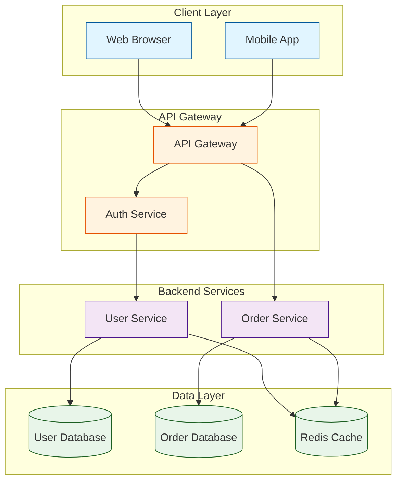

### Step 4: Apply Professional Styling

Enhance visual quality with consistent styling:

**Color Schemes (Recommended):**
```
Client/Frontend:     #e1f5ff (light blue), stroke #01579b (dark blue)
API/Gateway:         #fff3e0 (light orange), stroke #e65100 (dark orange)
Services/Backend:    #f3e5f5 (light purple), stroke #4a148c (dark purple)
Databases:           #e8f5e9 (light green), stroke #1b5e20 (dark green)
External Services:   #fce4ec (light pink), stroke #880e4f (dark pink)
Cache/Queue:         #fff9c4 (light yellow), stroke #f57f17 (dark yellow)
Security/Auth:       #ffebee (light red), stroke #b71c1c (dark red)
```

**Define CSS classes:**
```mermaid
classDef client fill:#e1f5ff,stroke:#01579b,stroke-width:2px
classDef service fill:#f3e5f5,stroke:#4a148c,stroke-width:2px
classDef data fill:#e8f5e9,stroke:#1b5e20,stroke-width:2px

class NodeA,NodeB client
class NodeC,NodeD service
class NodeE data
```

Or use inline styling:
```mermaid
style NodeA fill:#ff9,stroke:#333,stroke-width:4px
```

### Step 5: Generate Interactive Output

Convert Mermaid code to interactive HTML:

**Method 1: Using the Script (Recommended)**

1. Save Mermaid code to a `.mmd` file:
```bash
# Example: Save as system-architecture.mmd
graph TB
    A[Client] --> B[API]
    B --> C[(Database)]
```

2. Run the generation script:
```bash
python scripts/generate_diagram.py system-architecture.mmd \
    -o interactive-architecture.html \
    -t "System Architecture" \
    --theme default \
    --background "#f5f5f5"
```

3. Output: `interactive-architecture.html` with:
   - Pan/zoom controls
   - Export to PNG/SVG buttons
   - Professional styling
   - Keyboard shortcuts

**Method 2: Manual HTML Creation**

If custom modifications are needed:
1. Read the template: `assets/interactive-diagram-template.html`
2. Replace placeholders:
   - `{{DIAGRAM_TITLE}}` → Your title
   - `{{THEME}}` → `default`, `forest`, `dark`, `neutral`, or `base`
   - `{{BACKGROUND_COLOR}}` → CSS color value
   - `{{MERMAID_CODE}}` → Your Mermaid diagram code
3. Save as `.html` file

### Step 6: Provide Multiple Formats

Deliver diagrams in the formats most useful to the user:

1. **Mermaid Code** (`.mmd` file):
   - Version controllable
   - Easy to edit and update
   - Can be embedded in markdown docs

2. **Interactive HTML**:
   - For presentations and exploration
   - Includes pan/zoom for complex diagrams
   - Built-in export capabilities

3. **Exports** (generated from HTML):
   - **PNG**: For documents, slides, wikis
   - **SVG**: For high-quality print, further editing

### Step 7: Documentation and Context

Always provide context with the diagram:

**Include:**
- Brief description of what the diagram shows
- Key components and their roles
- Important flows or interactions highlighted
- Assumptions or constraints
- Links to related documentation

**Format:**
Create a markdown file alongside the diagram:
```markdown
# System Architecture Diagram

## Overview
This diagram shows the high-level architecture of our e-commerce platform.

## Key Components
- **API Gateway**: Routes requests, handles auth
- **User Service**: User management and authentication
- **Order Service**: Order processing and fulfillment
- **Database Layer**: PostgreSQL for persistent storage, Redis for caching

## Data Flow
1. Client requests hit the API Gateway
2. Gateway authenticates via Auth Service
3. Requests are routed to appropriate microservices
4. Services interact with databases as needed

## Updated
2024-01-26

## Related Docs
- API Documentation: /docs/api
- Database Schema: /docs/schema
```

## Advanced Techniques

### Complex Systems: Progressive Disclosure

For large, complex systems, create multiple diagrams at different levels:

**L1 - High-Level Overview:**
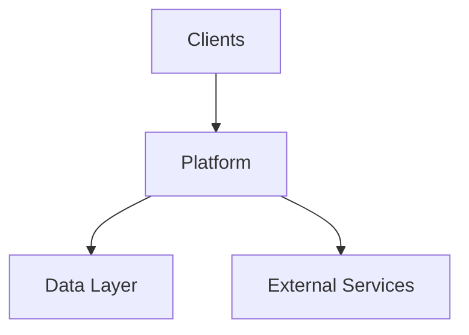

**L2 - Component Level:**
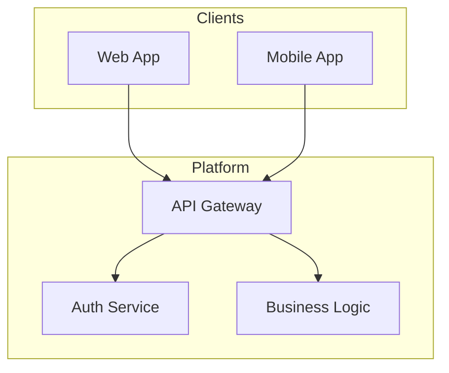

**L3 - Detailed Technical:**
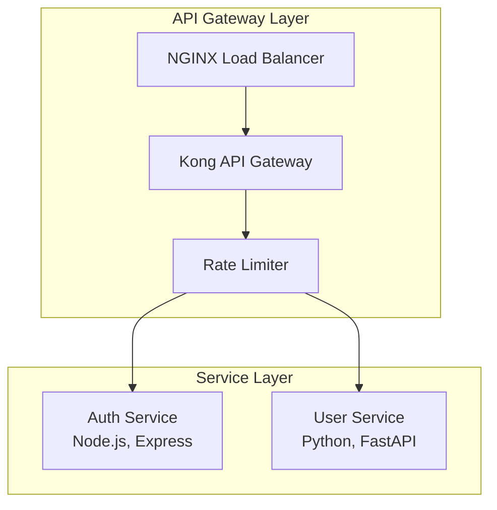

### Combining Multiple Diagram Types

Document a feature from multiple perspectives:

**1. Architecture (Flowchart):**
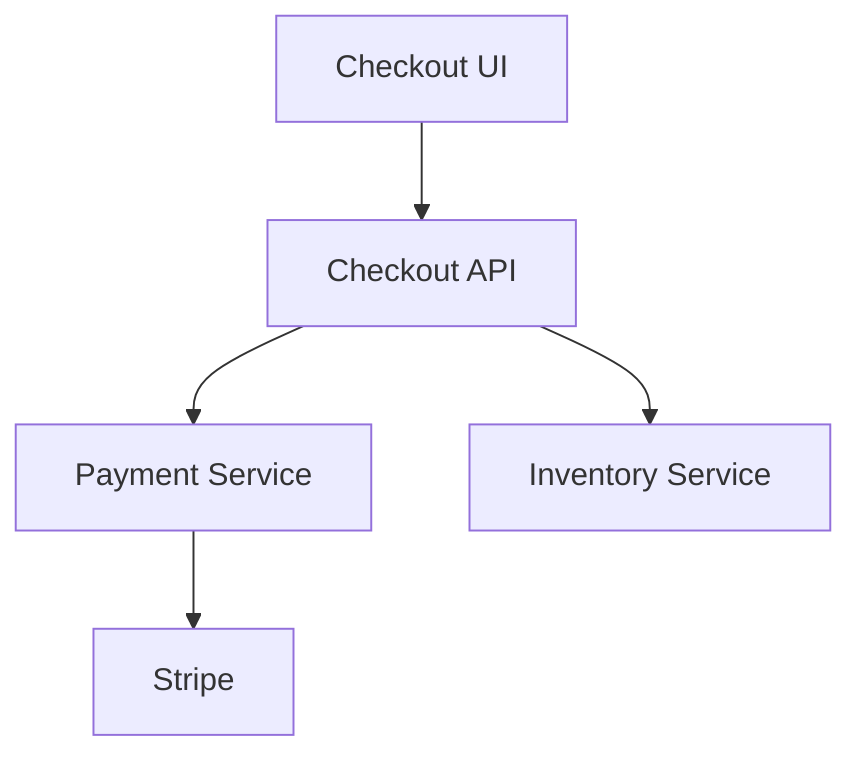

**2. Sequence (API Flow):**
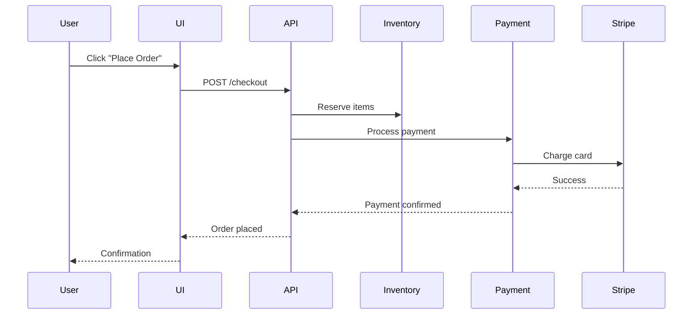

**3. State (Order Lifecycle):**
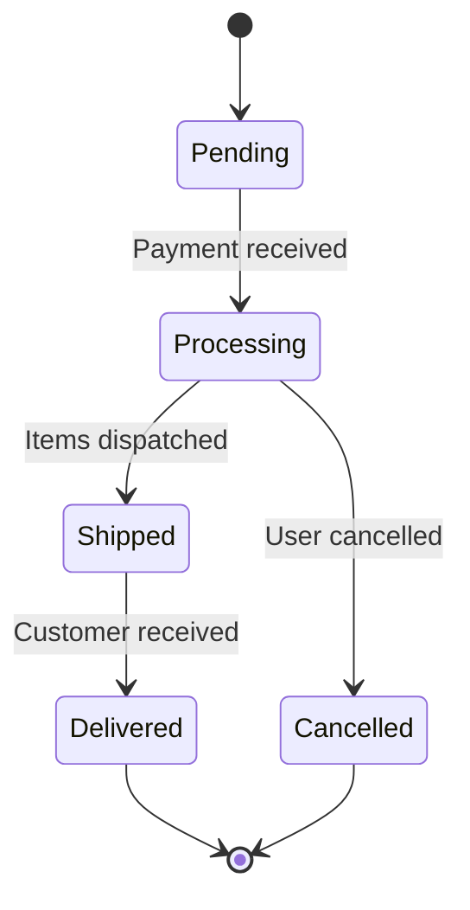

### Theme Customization

Available built-in themes:
- `default` - Clean, professional blue/gray
- `forest` - Green nature theme
- `dark` - Dark mode with high contrast
- `neutral` - Grayscale minimalist
- `base` - Basic black and white

**Custom theme example:**
```bash
python scripts/generate_diagram.py diagram.mmd \
    --theme dark \
    --background "#1a1a1a" \
    -t "Dark Mode Architecture"
```

## Common Use Cases

### Use Case 1: Microservices Architecture

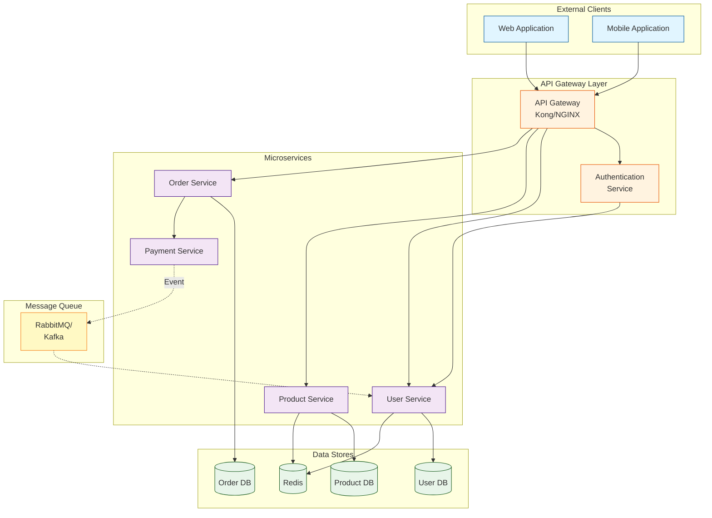

### Use Case 2: CI/CD Pipeline

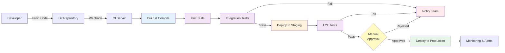

### Use Case 3: Database Schema (ER Diagram)

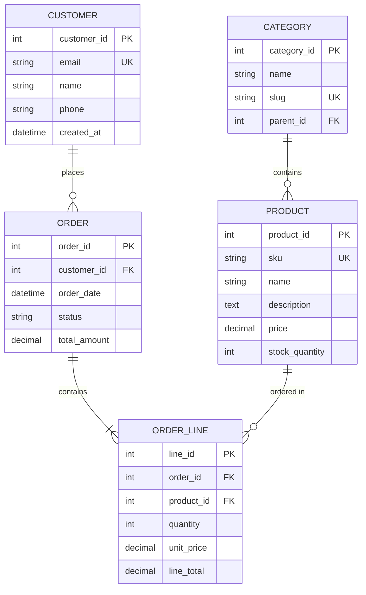

### Use Case 4: OAuth 2.0 Flow (Sequence Diagram)

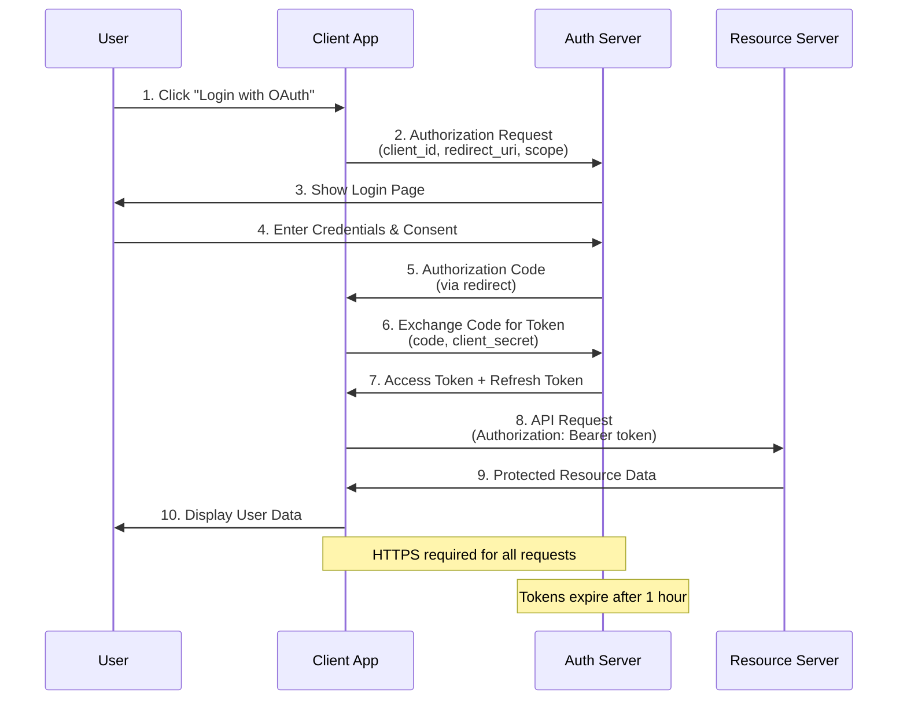

## Troubleshooting Common Issues

### Syntax Errors
- Verify proper spacing and line breaks
- Check arrow syntax (`-->`, `-.->`, `==>`)
- Ensure brackets match: `[Node]`, `(Node)`, `{Node}`
- Validate subgraph opening/closing

### Rendering Issues
- Test Mermaid code at https://mermaid.live/ before generating HTML
- Check for special characters in labels (escape if needed)
- Verify theme name is valid
- Ensure template placeholders are properly replaced

### Layout Problems
- Choose appropriate orientation (`TB` vs `LR`)
- Use subgraphs to organize complex diagrams
- Consider splitting into multiple focused diagrams
- Adjust node label lengths for better fit

### Export Quality
- PNG exports at 2x resolution for clarity
- SVG provides infinite scaling
- For presentations, use HTML with interactive zoom

## Professional Checklist

Before delivering a diagram, verify:

- [ ] Correct diagram type for the content
- [ ] Clear, descriptive title
- [ ] Consistent naming conventions
- [ ] Appropriate node shapes for semantic meaning
- [ ] Logical flow direction (TB or LR)
- [ ] Color coding applied consistently
- [ ] Subgraphs used for grouping when helpful
- [ ] No overlapping arrows or text
- [ ] Labels are concise but descriptive
- [ ] Styling matches intended audience
- [ ] Interactive HTML generated
- [ ] Mermaid source code saved (.mmd)
- [ ] Context documentation provided
- [ ] Tested in target viewing environment

## Summary

This skill provides everything needed to create professional, interactive flow diagrams:

1. **Complete Mermaid syntax** in `references/mermaid-syntax.md`
2. **Professional design guidelines** in `references/diagram-best-practices.md`
3. **Automated generation script** in `scripts/generate_diagram.py`
4. **Interactive HTML template** in `assets/interactive-diagram-template.html`

**Workflow:**
1. Understand requirements and choose diagram type
2. Write Mermaid code with proper styling
3. Generate interactive HTML using the script
4. Provide Mermaid source + HTML + documentation
5. Export to PNG/SVG as needed

Create diagrams that are not just functional, but visually professional, easy to navigate, and valuable documentation assets.
