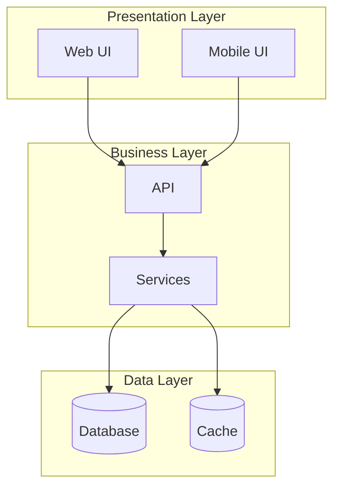
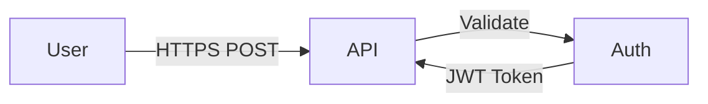
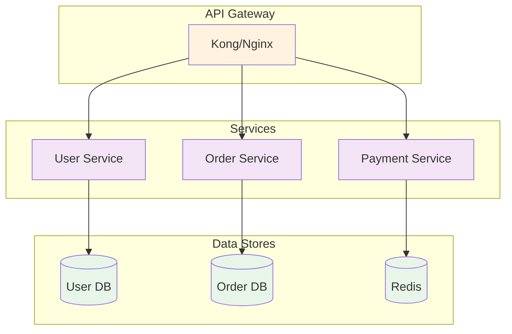
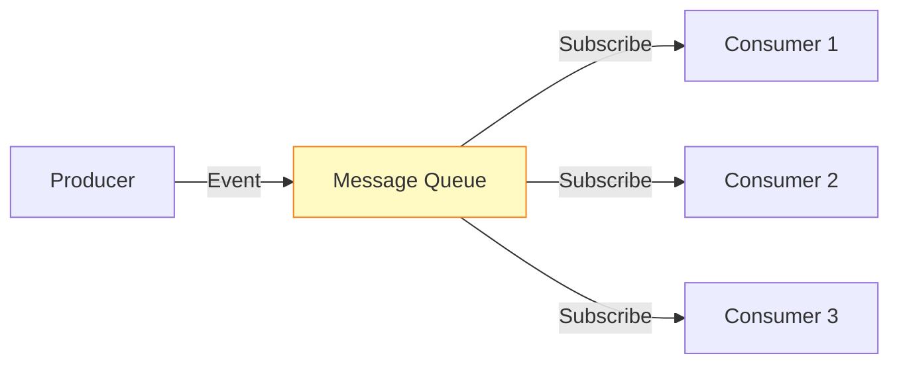
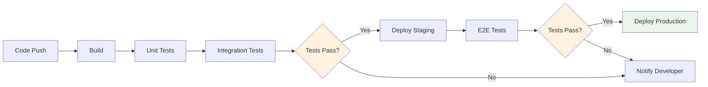
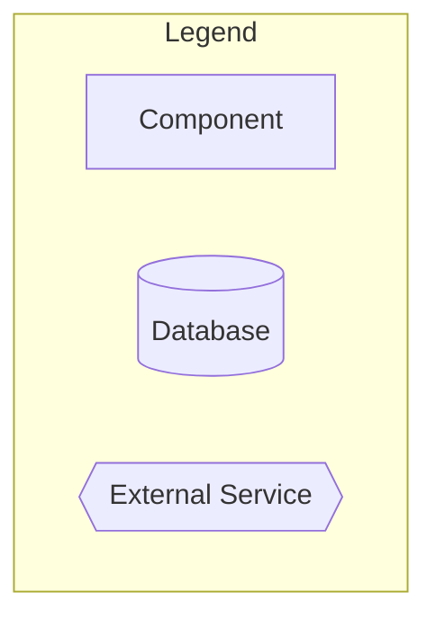
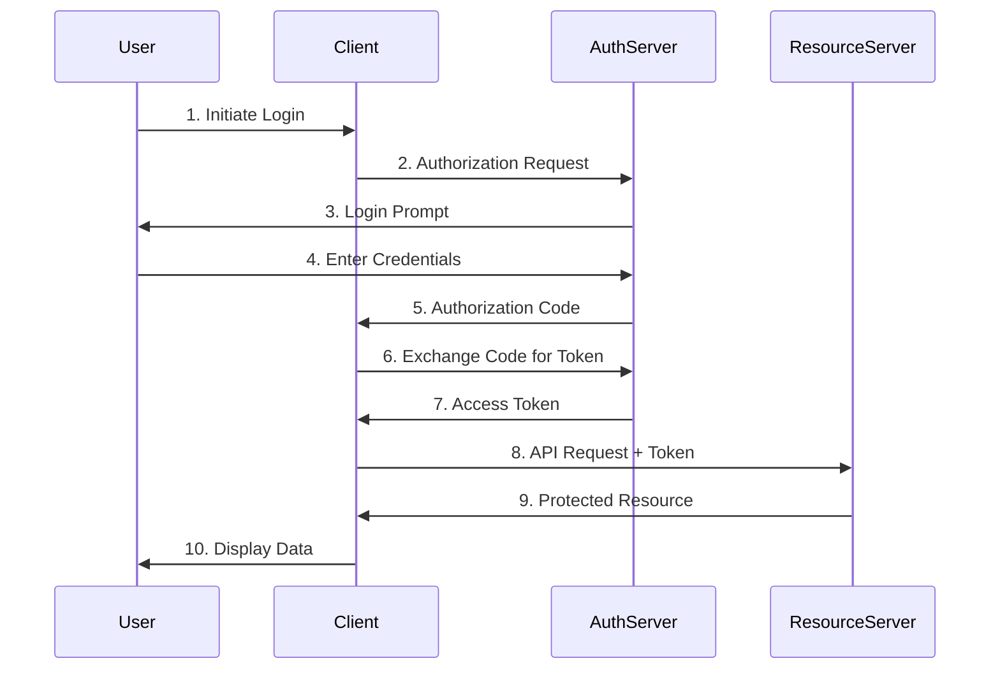
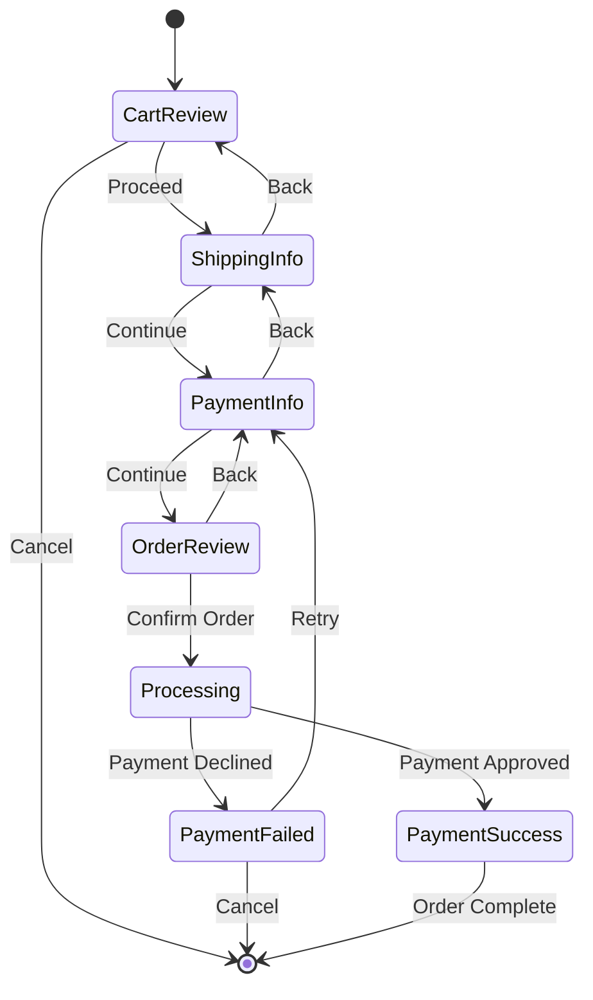
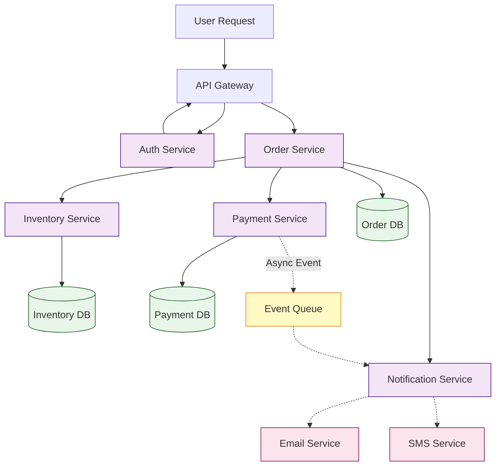

# Flow Diagram Best Practices

Professional guidelines for creating effective flow diagrams for system design and documentation.

## General Principles

### 1. Purpose-Driven Design

Every diagram should have a clear purpose:
- **Architecture diagrams**: Show system components and their relationships
- **Data flow diagrams**: Illustrate how data moves through the system
- **Process flows**: Document business workflows and decision trees
- **Sequence diagrams**: Explain API interactions and timing
- **ER diagrams**: Model database schema and relationships

### 2. Audience Awareness

Tailor complexity to your audience:
- **Executive/Business**: High-level, minimal technical detail, focus on business value
- **Product/Design**: User journeys, interactions, feature flows
- **Developers**: Technical architecture, API flows, class structures
- **DevOps/SRE**: Infrastructure, deployment pipelines, monitoring flows
- **QA/Testing**: Test flows, state transitions, edge cases

### 3. Progressive Disclosure

For complex systems, create multiple diagrams at different abstraction levels:
- **L1 - Overview**: 30,000 ft view, major components only
- **L2 - Component**: Zoom into specific subsystems
- **L3 - Detailed**: Show implementation details, class structures

## Diagram Selection Guide

### When to Use Each Diagram Type

| Need | Best Diagram Type | Example Use Case |
|------|-------------------|------------------|
| System architecture | Flowchart (graph TB) | Microservices architecture |
| API interactions | Sequence diagram | OAuth flow, checkout process |
| Database design | ER diagram | E-commerce data model |
| State management | State diagram | Order status lifecycle |
| User experience | User journey | Shopping cart flow |
| Project planning | Gantt chart | Sprint timeline |
| Class design | Class diagram | OOP architecture |
| Version control | Git graph | Release branching strategy |
| Data analysis | Pie/Quadrant chart | Market analysis |

### Combining Diagram Types

For comprehensive documentation, use multiple diagram types:

**Example: E-commerce Platform**
1. **Architecture Overview** (Flowchart): Overall system components
2. **Checkout Flow** (Sequence): User → Frontend → API → Payment
3. **Database Schema** (ER Diagram): Users, Orders, Products relationships
4. **Order Lifecycle** (State Diagram): Pending → Processing → Shipped → Delivered
5. **User Journey** (Journey Diagram): Browse → Cart → Checkout → Confirmation

## Visual Design Best Practices

### Color Coding Strategy

Use consistent colors to represent categories:

```
Client/Frontend:     Blue tones (#e1f5ff, #01579b)
API/Gateway:         Orange tones (#fff3e0, #e65100)
Services/Backend:    Purple tones (#f3e5f5, #4a148c)
Databases:           Green tones (#e8f5e9, #1b5e20)
External/3rd Party:  Pink tones (#fce4ec, #880e4f)
Cache/Queue:         Yellow tones (#fff9c4, #f57f17)
Security/Auth:       Red tones (#ffebee, #b71c1c)
```

### Node Shape Semantics

Use shapes to convey meaning:

- **Rectangle** `[Node]`: Standard component/process
- **Rounded Rectangle** `(Node)`: Subprocess/module
- **Database** `[(Database)]`: Data storage
- **Circle** `((Node))`: Start/end points, events
- **Diamond** `{Decision}`: Decision points, conditionals
- **Hexagon** `{{Service}}`: External services, APIs
- **Parallelogram** `[/Data/]`: Input/output data

### Arrow Semantics

- **Solid arrow** `-->`: Primary flow, synchronous calls
- **Dotted arrow** `-.->`: Secondary flow, async calls, optional
- **Thick arrow** `==>`: Critical path, main data flow
- **No arrow** `---`: Relationship without direction

## Layout and Organization

### Flowchart Orientation

**Top-Down (graph TB):**
- Best for: Process flows, hierarchies, system layers
- Natural reading pattern
- Good for depicting layers (UI → API → DB)

**Left-Right (graph LR):**
- Best for: Timelines, sequences, pipelines
- Wide diagrams work better horizontally
- Good for CI/CD pipelines, data pipelines

### Subgraph Usage

Group related components for clarity:



### Spacing and Alignment

- Maintain consistent spacing between nodes
- Align nodes at the same level
- Avoid crossing arrows when possible
- Use invisible nodes for alignment if needed

## Naming Conventions

### Node Labels

**DO:**
- Use clear, descriptive names: `User Authentication Service`
- Be consistent: If one is "User Service", don't use "Payment Svc"
- Use proper case: `Payment Gateway` not `payment gateway`
- Keep concise: `Auth` instead of `Authentication and Authorization Service`

**DON'T:**
- Use cryptic abbreviations: `UAS` instead of `Auth Service`
- Mix naming styles: `userService` vs `PaymentGateway`
- Use unnecessarily long names that clutter the diagram

### Link Labels

Add context to arrows when needed:


## Architecture-Specific Patterns

### Microservices Architecture



### Event-Driven Architecture



### CI/CD Pipeline



## Common Anti-Patterns to Avoid

### 1. Over-Complexity
**Problem**: Too many nodes, connections, details
**Solution**: Split into multiple focused diagrams

### 2. Inconsistent Styling
**Problem**: Random colors, mixed naming conventions
**Solution**: Define and follow a style guide

### 3. Missing Context
**Problem**: Diagram without title, legend, or annotations
**Solution**: Always add titles, dates, and context notes

### 4. Ambiguous Flow
**Problem**: Unclear arrow directions, circular dependencies without explanation
**Solution**: Use clear directional arrows, add sequence numbers

### 5. Technology-Specific Details
**Problem**: Including implementation details in architecture diagrams
**Solution**: Keep high-level diagrams abstract, create separate technical diagrams

## Annotation and Documentation

### Adding Notes

```mermaid
graph LR
    A[Client] --> B[API]
    B --> C[(Database)]

    note right of B: Rate limited to<br/>1000 req/min
```

### Version and Metadata

Include in diagram or filename:
- Creation date
- Last updated
- Version number
- Author/team
- System/project name

### Legend for Complex Diagrams

Add a legend when using custom symbols or colors:


## Accessibility Considerations

1. **Color Independence**: Don't rely solely on color to convey meaning
2. **Text Labels**: All nodes should have clear text labels
3. **High Contrast**: Ensure text is readable against backgrounds
4. **Shape Variety**: Use different shapes, not just colors, for categories

## Team Collaboration

### Standardization
- Create a team style guide
- Use consistent themes across projects
- Maintain a library of common patterns
- Version control your diagrams (store as .mmd files)

### Review Process
- Peer review architecture diagrams
- Validate with stakeholders
- Test diagram clarity with new team members
- Keep diagrams updated with system changes

## Tools and Workflow

### Recommended Workflow

1. **Sketch**: Start with rough draft on paper or whiteboard
2. **Draft**: Create first version in Mermaid
3. **Review**: Get feedback from team
4. **Refine**: Apply styling, colors, annotations
5. **Export**: Generate interactive HTML, PNG, or SVG
6. **Document**: Embed in documentation, PRD, or wiki
7. **Maintain**: Update as system evolves

### Version Control

Store diagrams as `.mmd` files:
```
docs/
  architecture/
    system-overview.mmd
    api-flows.mmd
    database-schema.mmd
```

## Performance and Scalability

For very large diagrams:
- Consider using external tools (draw.io, Lucidchart) for complex visuals
- Split into multiple linked diagrams
- Use Mermaid for generated/programmatic diagrams
- Cache rendered outputs for performance

## Export Formats

### When to Use Each Format

- **Interactive HTML**: For presentations, documentation sites, exploring complex diagrams
- **PNG**: For embedding in documents, slides, wikis
- **SVG**: For print, high-quality scaling, further editing
- **Mermaid Code**: For version control, collaboration, automation

## Real-World Examples

### Example 1: OAuth 2.0 Flow



### Example 2: E-Commerce Checkout



### Example 3: Microservices Data Flow



## Checklist for Professional Diagrams

Before finalizing your diagram:

- [ ] Clear title describing the diagram's purpose
- [ ] Consistent naming conventions
- [ ] Appropriate diagram type for the content
- [ ] Logical flow direction (top-down or left-right)
- [ ] Proper use of shapes for semantic meaning
- [ ] Consistent color scheme
- [ ] Readable font sizes and labels
- [ ] No overlapping arrows or text
- [ ] Annotations for complex sections
- [ ] Legend if using custom symbols/colors
- [ ] Date and version information
- [ ] Tested in target format (HTML/PNG/SVG)
- [ ] Peer reviewed for accuracy
- [ ] Accessible (not relying solely on color)
- [ ] Scales well when zoomed or exported

## Further Learning

- Study architecture diagrams from major tech companies
- Review AWS/Azure/GCP architecture diagrams
- Analyze open-source project documentation
- Practice with real-world scenarios
- Iterate based on feedback
