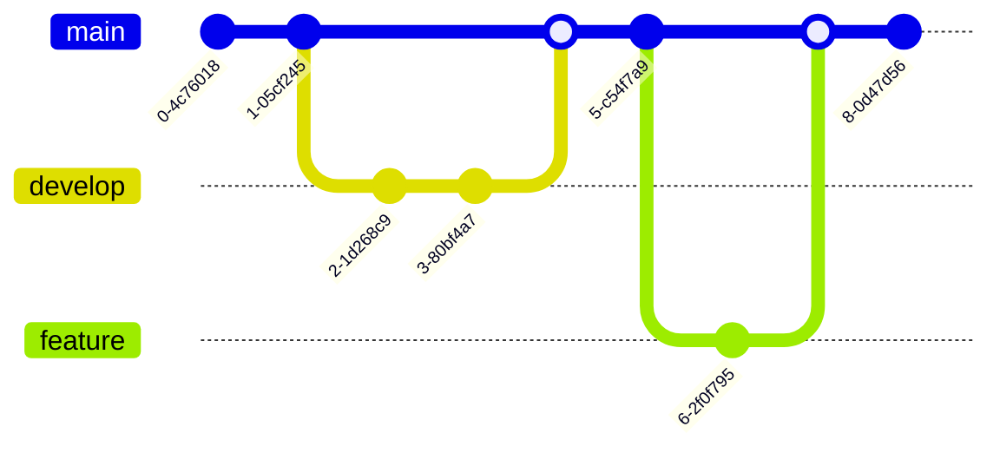

# Mermaid Diagram Syntax Reference

Complete reference for creating professional flow diagrams using Mermaid.

## Diagram Types

### 1. Flowchart / Graph Diagrams

**Orientations:**
- `graph TD` - Top to Down (vertical)
- `graph LR` - Left to Right (horizontal)
- `graph BT` - Bottom to Top
- `graph RL` - Right to Left

**Node Shapes:**


**Arrow Types:**
```mermaid
graph LR
    A --> B  %% Solid arrow
    C --- D  %% Line without arrow
    E -.-> F  %% Dotted arrow
    G -.- H  %% Dotted line
    I ==> J  %% Thick arrow
    K === L  %% Thick line
    M -- Text --> N  %% Arrow with text
    O -->|Text| P  %% Alternative text syntax
```

**Example System Architecture:**


### 2. Sequence Diagrams

Show interactions between actors/systems over time.


**Advanced Features:**


### 3. State Diagrams

Show state transitions and system behavior.


**With Nested States:**


### 4. Entity Relationship Diagrams (ER Diagrams)

Database schema and relationships.


**Relationship Types:**
- `||--||` : One to one
- `||--o{` : One to zero or more
- `||--|{` : One to one or more
- `}o--o{` : Zero or more to zero or more
- `}|--|{` : One or more to one or more

### 5. Class Diagrams

Object-oriented design and class relationships.


**Relationship Types:**
- `<|--` : Inheritance
- `*--` : Composition
- `o--` : Aggregation
- `-->` : Association
- `..>` : Dependency
- `..|>` : Realization

### 6. Gantt Charts

Project timelines and task scheduling.


### 7. User Journey Diagrams

Map user interactions and experiences.


### 8. Git Graph

Version control branching visualization.



### 9. Pie Charts

Simple data visualization.


### 10. Quadrant Charts

Strategic planning and analysis.


## Styling and Theming

### Built-in Themes

Available themes: `default`, `forest`, `dark`, `neutral`, `base`

Specify in HTML initialization:
```javascript
mermaid.initialize({ theme: 'dark' });
```

### Custom Styling with CSS Classes


### Inline Styling


## Best Practices

### 1. Clarity and Readability
- Use descriptive node labels
- Keep diagrams focused on one concept
- Avoid overcrowding nodes
- Use consistent naming conventions

### 2. Visual Hierarchy
- Use different node shapes to indicate different types
- Apply color coding for categories
- Use thicker arrows for primary flows
- Use dotted lines for optional/conditional flows

### 3. Layout Optimization
- Choose appropriate orientation (TB vs LR)
- Group related nodes together
- Use subgraphs for complex sections
- Maintain consistent spacing

### 4. Professional Styling
- Use consistent color schemes
- Apply brand colors when appropriate
- Ensure sufficient contrast
- Use professional, clean themes

### 5. Complex Diagrams
- Break large diagrams into smaller, focused ones
- Use subgraphs to group related components
- Add notes and annotations for clarity
- Consider using multiple diagram types for different perspectives

## Example: Complete System Architecture


## Advanced Techniques

### Subgraphs for Grouping


### Comments in Mermaid


### Links and Interactions


## Common Issues and Solutions

1. **Diagram not rendering**: Check syntax, ensure proper spacing
2. **Arrows pointing wrong way**: Verify arrow direction syntax
3. **Labels overlapping**: Adjust node spacing or orientation
4. **Special characters**: Escape or use quotes for node labels
5. **Complex layouts**: Use subgraphs and manual node positioning

## Resources

- Official Mermaid Docs: https://mermaid.js.org/
- Live Editor: https://mermaid.live/
- Syntax Testing: Use the live editor to validate complex diagrams
